# Harmonia em Movimento

Frase-conceito: Brinquedo de equilíbrio que cria movimento entre as peças e os utilizadores.

## Conceito

Este projeto começou por surgir através da proposta Nestor para a disciplina de Design de Produto III.  Usei esta oportunidade para criar a minha maquete final.

 "O **Projeto NESTOR** é uma iniciativa de investigação que explora a interseção entre sustentabilidade industrial, design e fabricação digital. No seu núcleo, o projeto visa desenvolver um sistema inteligente que otimize a utilização de material excedente da indústria do mobiliário, através da inserção automática de pequenos brinquedos de madeira nas áreas não utilizadas dos planos de corte CNC."

 Usei como base para construir este projeto um mooboard criado em conjunto com o meu grupo de Produto. 

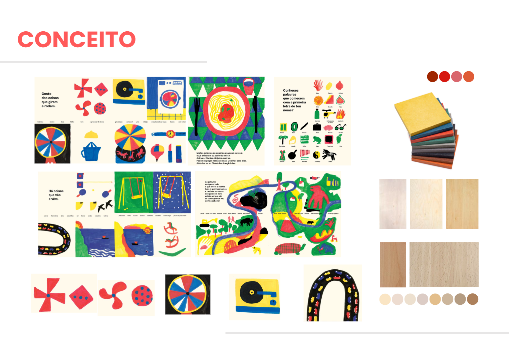

Este projeto teve diversas fases a partir do momento em que era um jogo de encaixes, um carrossel, um jogo de equilíbrio até chegar a esta proposta. 

Fig. 1 - Prancha-Resumo Inicial

O conceito deste jogo começou a florescer depois de realizar esboços sobre a ideia e possíveis mecanismos.

Fig. 2 - Esboços Rápidos da Ideia 

Fig. 3 - Esboços em Detalhe

Fig. 4 - Prancha Resumo do Conceito Finalizada

## Tecnologias Usadas

Uma ou mais tecnologias estudadas em laboratório:

- [ ] Corte 2D (laser / vinil)
- [ ] Impressão 3D
- [x] CNC
- [ ] Micro:bit / computação física
- [ ] Outras —

## Processo

### Iteração 1 — [Maquete 1]

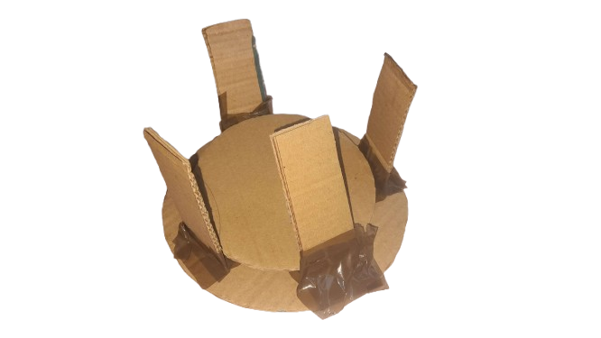

Como não conseguia avançar com esta ideia por já ter desenvolvido tantas ideias antes, tentei fazer uma maquete extremamente simples com cartão e fita-cola.

**O que tentei:** Tentei iniciar o projeto e avançar com o meu conceito.

**O que aprendi:** Aprendi que foi extremamente essencial para começar a perceber os mecanismos do objeto e a sua função como brinquedo.

### Iteração 2 — [Modelação 3D - Maquete 3D]

Após criar o meu ficheiro híbrido no Fusion adicionei os parâmetros.

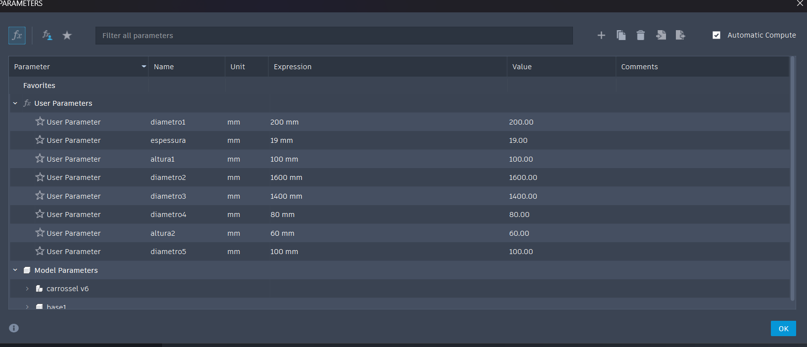

Desenhei um círculo para a base com o primeiro parâmetro de 200 mm.

Depois usei a extrusão na base com a minha espessura geral: 19 mm. Na mesma base, desenhei outro círculo de 80 mm.

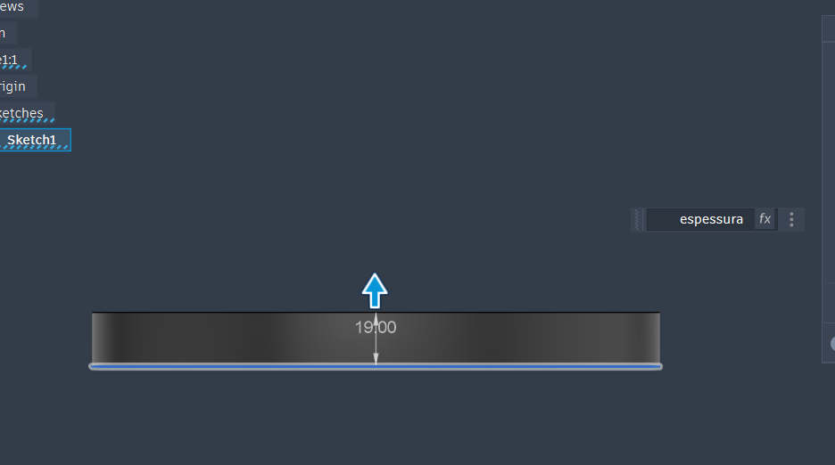

Neste mesmo círculo criei dois retângulos que depois deixei tangentes ao círculo de forma simétrica com a medida da espessura (19 mm). Depois deste passo usei a extrusão num dos retângulos.

Criei um corte inferior com 25,95 cm que depois extrudi como corte.

Usei a extrusão no outro retângulo também e desta vez criei um corte na área superior com a mesma medida e usei a extrusão para cortar a peça novamente. Depois destes passos usei o combine nas duas peças.

Criei outro círculo com 100 mm e usei o para criar um buraco na base à volta das peças. De forma similar criei outro círculo igual mas desta vez por cima das peças, que depois acrescentei a espessura com a extrusão.

Criei outro esboço na base debaixo com uma peça que extrudi com a espessura para depois criar as outras peças com o circular pattern que circulam esta base.

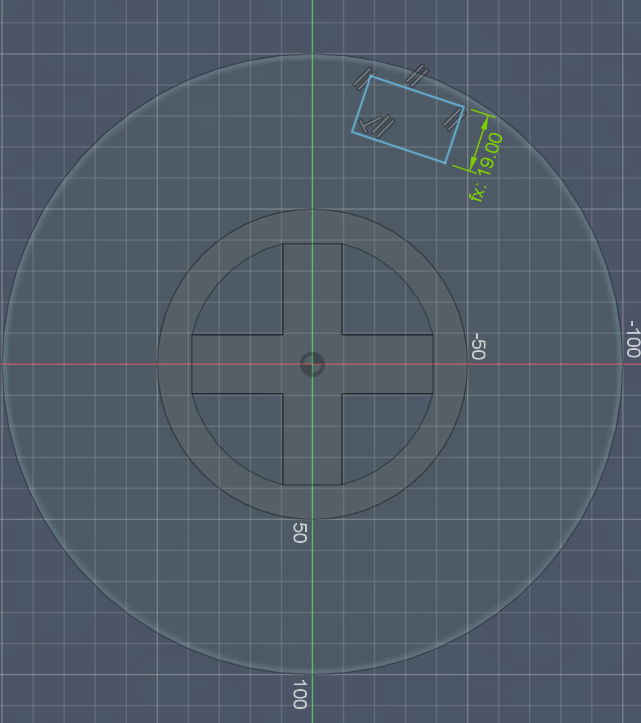

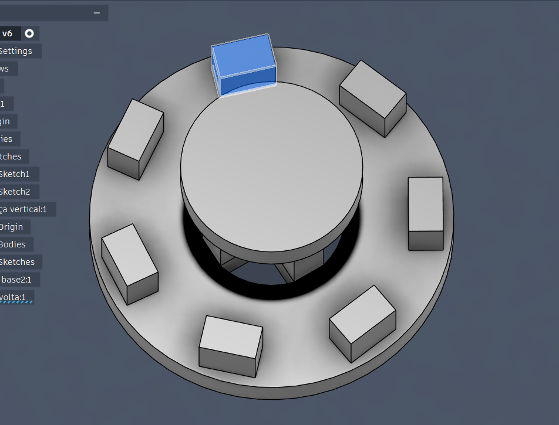

De seguida criei um círculo nesta base de construção na imagem interior. Fiz um círculo que quase não tocasse nas peças e extrudi para cima com a espessura. De seguida criei outro esboço tangente a esta base e extrudi com a mesma grossura desta base para baixo. Por fim adicionei o combine para esta alavanca ficar junta a esta base circular.

Acabei por realizar outra maquete 3d que não resultou tão bem mas que é composta pelos passos similares da maquete final, o que muda são os parâmetros e a dependência entre os corpos do objeto.

**O que tentei:** Tentei simplificar as formas ao máximo só para ter um modelo 3d para perceber a construção ideal para o meu modelo 3d. Criar um bom equilíbrio entre o tamanho das peças.

**O que aprendi:** Aprendi que esta não era a melhor opção porque todas as peças exigiam extra bases para as segurarem. Tive de pensar noutras soluções e quando tentei dispor esta segunda maquete final para a CNC percebi que não ia funcionar pelas partes com menos de 5 mm e pelos apertos.

### Iteração 3 — [Maquete 3]

Esta maquete foi criada tanto para poder experimentar fisicamente as proporções como para testar a sua funcionalidade.

Algumas fotos do esboço inicial para poder maquetizar as medidas.

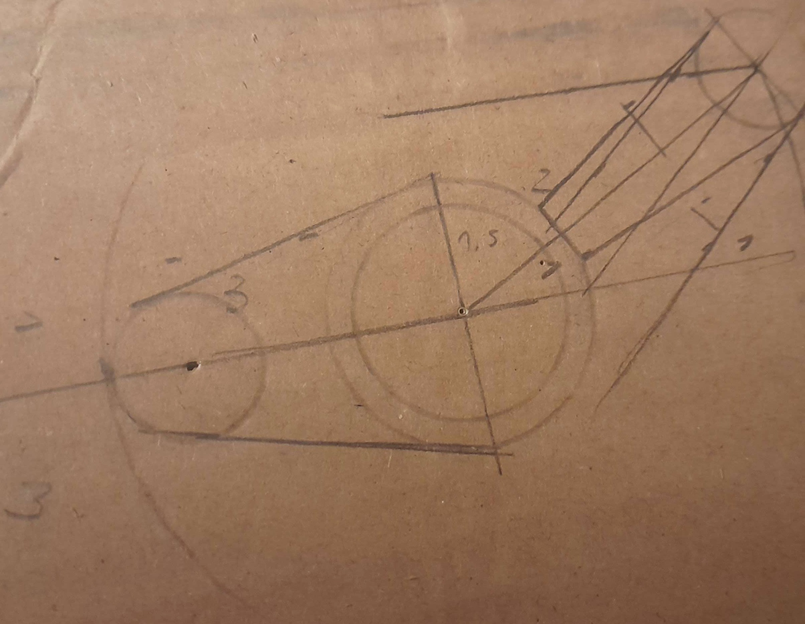

Para poder ficar fiel ao projeto em todas as peças tive que colar 3 pedaços de cartão para ficar com a mesma espessura.

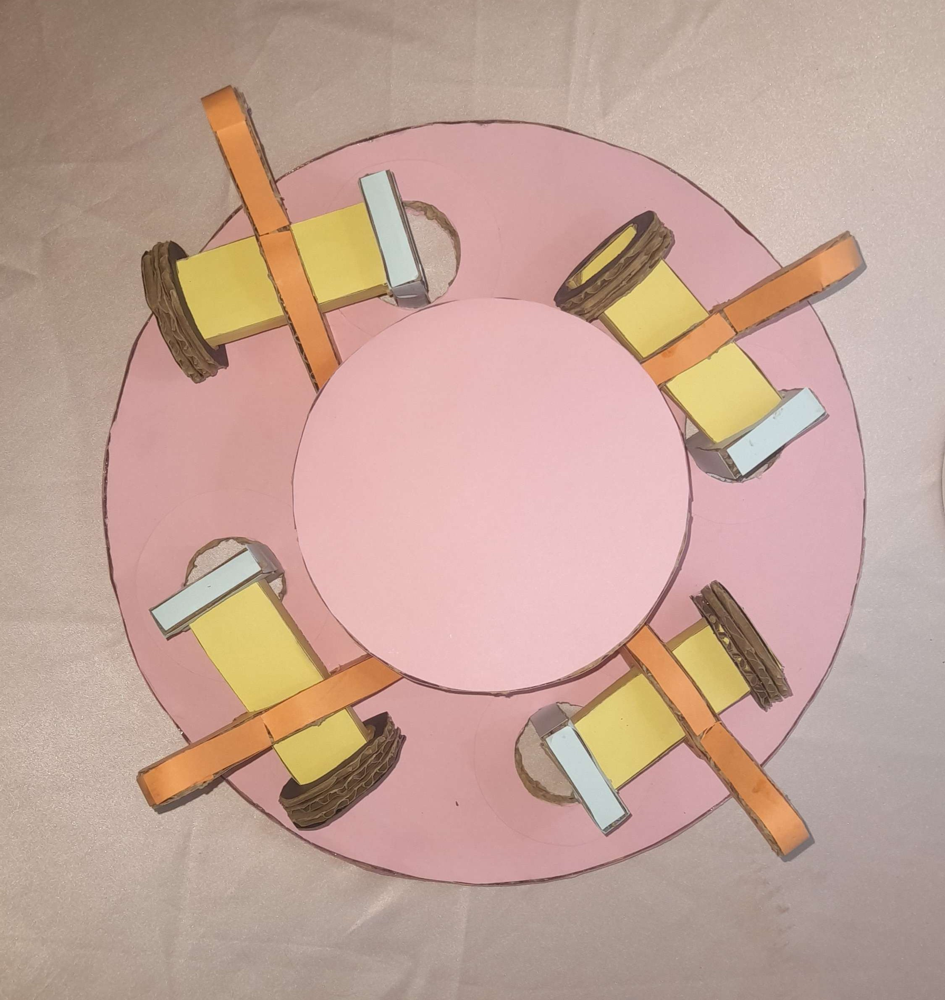

**O que tentei:** Tentei ser fiel ao máximo e ajustar as medidas como achava que deveriam ser detalhadas.

**O que aprendi:** Aprendi que apesar de a maquete ter corrido bem que o material causa problemas com as medidas sendo que a cartolina e o cartão são moderadamente mais ágeis do que mdf.

### Iteração 4 — [Maquete 4]

Comecei pelos parâmetros:

(Todas as medidas são editadas com a matemática do Fusion, por este motivo vou evitar mencionar-las). Depois de já ter criado um círculo para a base, criei um esboço de um círculo na mesma base. usei a extrusão e usei o circular pattern. Neste mesmo esboço desenhei um retângulo tangente ao círculo que depois extrudi com a espessura da base (1,2 cm) para baixo.

Desenhei também no plano frontal em cima da base metade de uma curva com 3,50 cm de altura e 4 cm de largura que dupliquei para o lado com o Mirror. Depois desenhei um corte inferior de 1,75 cm de altura e 1,20 cm de largura com as medidas divididas pela linha central.
e outro de uma curva que depois usei o mirror. Mais tarde usei a extrusão e desenhei outro igual que extrudi e criei um corte igual por cima que depois com o combine ficaram os dois encaixados.

Com aqueles retângulos extrudidos da base, extrudi para cima novamente com 4,80 cm ( a partir de um comprimento, 3 cm, menos a espessura)

Depois esboçei centrado em cada um destes paralelepípedos um círculo com 2,98 cm (tem uma folga de 0,2 mm) e adicionei outro retângulo dentro deste círculo com a espessura de largura e 2,70 de largura com os vértices tangentes ao círculo (pode ter folga).

Extrudi em corte com a espessura em todos estes paralelepípedos. 

Usei o retângulo anteriormente desenhado e extrudi com o seu comprimento: 9 cm. De seguida usei o circular pattern quatro vezes para adicionar aos outros elementos.

Depois desenhei na ponta do paralelepípedo o círculo para a tranca que não permite as outras peças se mexerem. Extrudi para dentro com a espessura e voltei a usar circular pattern.

Depois criei um plano de construção e desenhei no meio do paralelepípedo no plano lateral a minha alavanca. começo por fazer o círculo interior com a respetiva folga e o exterior com 3,01 e 3,50. De seguida desenhei uma linha do ponto central do círculo com 4 cm até à tangente do círculo da direita que tem 1,50 e situa-se abaixo da base superior. Do mesmo ponto central meço verticalmente 3 cm e 5,50 cm de largura até ao centro do nosso próximo círculo à esquerda. Este círculo tem 2,00 cm. Crio uma linha de apoio desde o ponto central do círculo de 3cm até ao centro do de 2,00 cm. faço uma linha tangente aos dois círculos que tem uma margem de 0,50 até à linha da simetria. Por fim, duplico com o Mirror esta linha e extrudo esta forma toda com a espessura toda a parte interior do círculo onde está o paralelepípedo. Volto a usar circular pattern para repetir quatro vezes.

Para criar a base superior faço um esboço dum círculo a partir de um plano de costrução com a altura das formas cruzadas que estão debaixo.

Para prender as primeiras formas cruzadas criadas depois da base extrudo com a espessura até à base e uso o combine e keep tools para fazer um buraco. Para ficar justo, adicionei dogbones.

No planeamento para a CNC não fiz arrange e fiz align, o align não ficou perfeito e ficou tudo desalinhado com a placa do ficheiro. Para cortar este ficheiro e definir as definições da fresa e outras questões para a CNC tive a assistência do professor. Usei uma placa de 12 mm.

RENDERS:

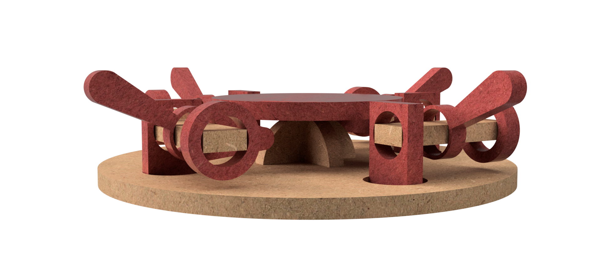

**O que tentei:** Tentei com que ficasse com um design organizado para a sua funcionalidade. Tentei evitar erros ou que o objeto se pudesse partir quando fosse cortado pela CNC.

**O que aprendi:** Aprendi que mesmo que use no minímo 5 mm as peças têm tendência a serem muito sensíveis por causa do material, a forma que é cortado ou até como se separa as peças. Aprendi que é preciso verificar sempre os ficheiros e ter experiência com manufaturação quando se trata de transmitir o objeto exatamente como é pensado.

## Resultado Final

Foto da placa depois de ser cortada:

PEÇAS INDIVIDUAIS:

PEÇA 1 4X
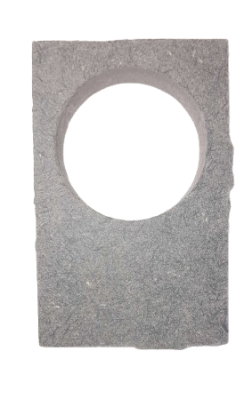
CONECTOR 4X
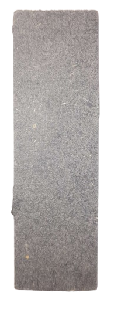
BASE 2 1X

ALAVANCA 4X

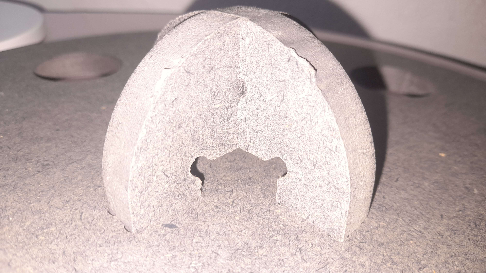

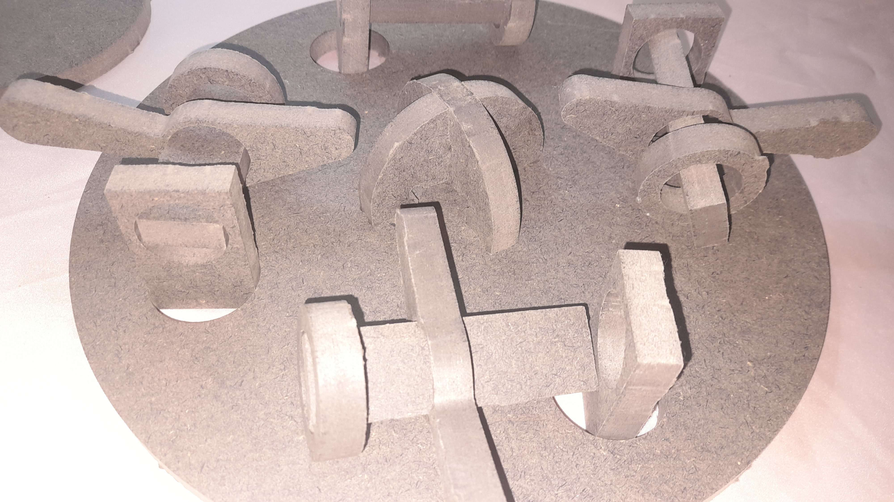

Maquete cortada em CNC finalizada. A base superior fica estável mas o resto dos elementos com os encaixes estão desproporcionais e soltos.

Demonstração do movimento:

## Reflexão

Faria as coisas com mais planeamento e com menos divergência de ideias. Por ter explorado tantas coisas não tive tempo de fazer parâmetros mais detalhados nem um objeto mais complexo ou com outras personalizações. Acredito que a parte da CNC correu mal porque nada encaixava e estava tudo muito solto ou muito apertado devido às folgas dos círculos.

Gostaria de pensar neste projeto futuramente como base de fundamento para outras ideias.
