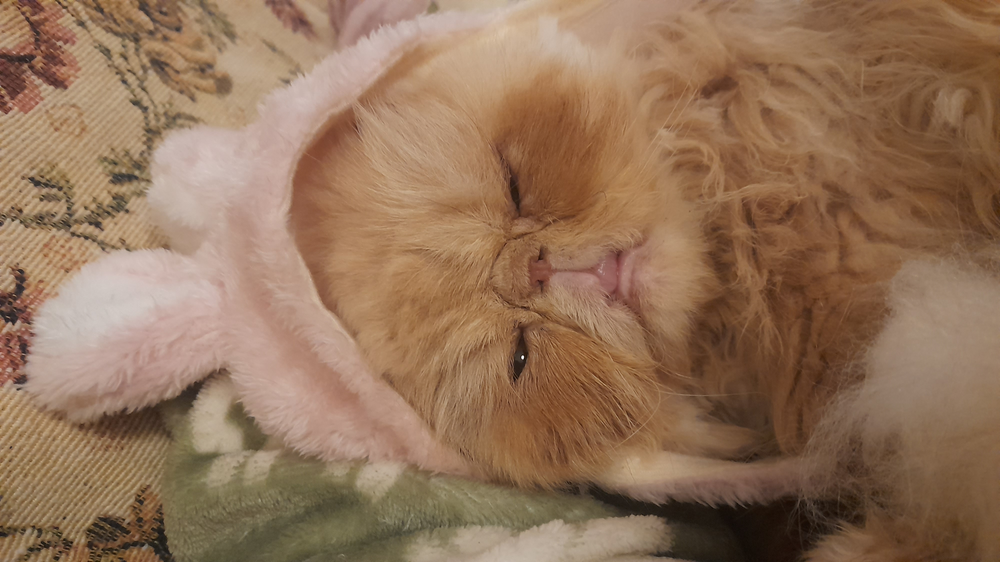

# Pixel

Frase-conceito: Pixelar o que emerge.
## Conceito

O projeto Pixel surgiu a partir do nome do meu animal de estimação, o meu gato. Pensei em criar uma "catch phrase" a partir do nome do meu gato sendo que a tecnologia usada para este projeto requer simplificar formas durante o processo.

## Tecnologias Usadas

Uma ou mais tecnologias estudadas em laboratório:

- [x] Corte 2D (laser / vinil)
- [ ] Impressão 3D
- [ ] CNC
- [ ] Micro:bit / computação física
- [ ] Outras —

## Processo

### Iteração 1 — [EDIÇÃO]

Primeiramente recolhi as imagens dos meus dois gatos (editei a primeira  foto a preto e branco) e juntei-as e comecei a cortar à volta.

Comecei por tentar pintar o gato na esquerda. Porém rapidamente me apercebi que não ia conseguir simplificar as cores por ter misturas de cores tão complexas.

Até este momento estive a usar o programa de desenho Krita para desenhar por cima mas ia ser difícil de fazer como vetor por isso passei para o Illustrator. Como a pixel só tem duas cores tentei simplificar as formas. Processo de pintura com a caneta do Illustrator:

**O que tentei:** Fazer duas figuras com cores distintas num programa de pintura
**O que aprendi:** Não se adequa como ficheiro par a Silhouette, têm que ser simplificadas as formas ao máximo para ter sucesso em como se retira e fica mais tarde.
### Iteração 2 — [Preparação e Corte]

Inicialmente a imagem estava muito grande então tive de diminuir o tamanho. Exportei como DXF. Destranquei a patilha, depois pus o Vinil encaixado na máquina Mudei as configurações para Vinil, fosco e liguei o computador à máquina.  Quando concluído carreguei no botão Descarregar e retirei da máquina o vinil.

Depois de ter o meu vinil pronto usei um material autocolante para arrancar as formas. Porém ficou mal colado e dificultou o processo.

**O que tentei:** Fazer duas figuras com cores distintas num programa de pintura
**O que aprendi:** Não se adequa como ficheiro par a Silhouette, têm que ser simplificadas as formas ao máximo para ter sucesso em como se retira e fica mais tarde. Formas em espinho ou finas dificultam o processo. Formas sobrepostas causam cortes extra sobrepostos no vinil e dificulta o processo de retirar as formas. Espaços apertados ou pequenos têm tendência a divergir para o lado ou ficarem mal cortados.
## Resultado Final

Imagem Final da Pixel do autocolante colado a uma folha.

## Reflexão

Se fizesse alguma coisa diferente seria poder ter feito mais experiências para compreender como a máquina trata a cor, o corte e o material. Não percebi por completo como a cor se comporta na máquina se for utilizada de formas diferentes. 

Gostaria de ter experimentado mais cores e formas mais de silhueta, sendo que esse é o intuito da máquina. Acredito que deveria ter sido mais sensível com o material porque esperava que fosse mais resistente. Acho que só houve uma coisa que falhei e foi o tratamento da parte oposta da cor: o branco, sendo que ele não existe na folha e causa algumas incoerências.
