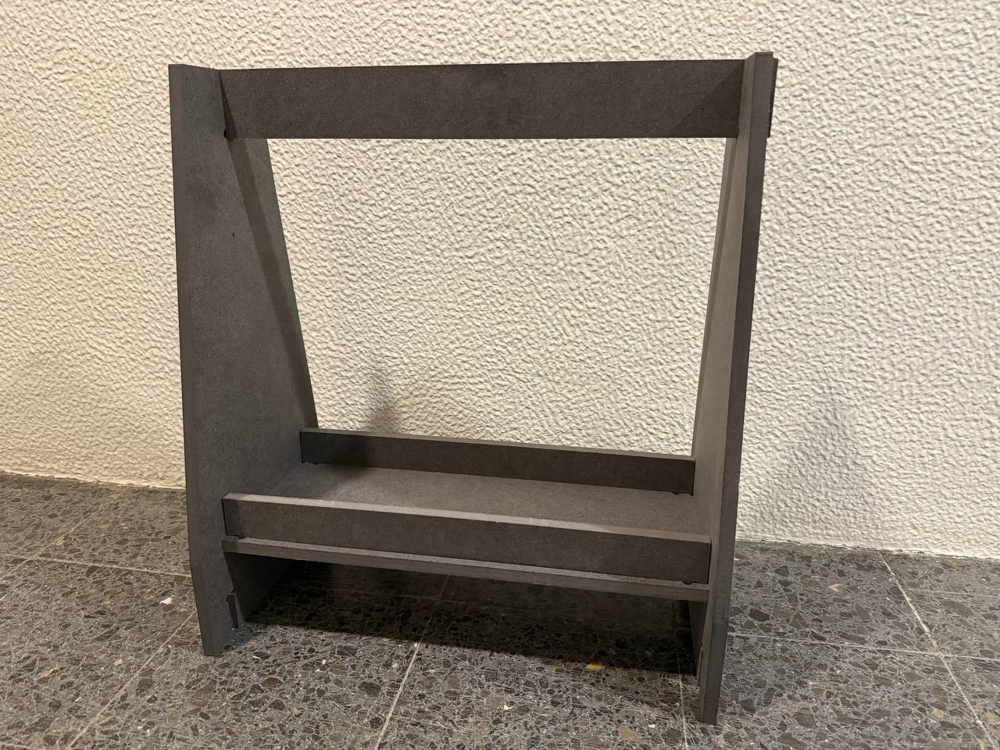

# Optimizar o espaço de armazenamento

Frase-conceito: criar mais espaço para guardar objetos e otimizar a organização do espaço.
## Conceito

Uma prateleira que pode ser utilizada para diversos fins, como sapatos, livros, material de arte, etc.

## Tecnologias Usadas

Uma ou mais tecnologias estudadas em laboratório:

- [ ] Corte 2D (laser / vinil)
- [ ] Impressão 3D
- [x] CNC
- [ ] Micro:bit / computação física
- [ ] Outras —

## Processo

### Iteração 1 — [Sketch]

**O que tentei:** O esboço foi provavelmente o que demorou mais tempo; tentei usar parâmetros pela primeira vez, o que fez com que tivesse demasiadas peças interligadas. 

No esboço, é também mais complicado do que a peça final, uma vez que retirei algumas peças desnecessárias.

**O que aprendi:** eficiência.

### Iteração 2 — [Autodesk Fusion]

Utilizei o Fusion 360 para criar o meu modelo, começando pelo esboço.

Para este modelo, como de costume, utilizei principalmente a ferramenta de extrusão e tive de o ajustar várias vezes para que o modelo ficasse com um aspeto «correto». 

Quando terminei, passei pela maioria das fendas com a ferramenta «dogbone», para que a fresa conseguisse cortar os ângulos mais estreitos.

Tive de ajustar bastante o tamanho, porque não conseguimos encontrar um pedaço de madeira adequado. Acho que passei por três versões diferentes, até chegar à versão final.

### Iteração 3 — [CNC]

Embora eu saiba que, por razões óbvias, esta etapa é a mais importante, não posso dizer muito sobre o assunto, uma vez que não estava presente. O professor colocou-o na máquina e, mais tarde, fui buscá-lo.

### Iteração 3 — [Vanguarda]

O último passo foi cortar as pontas soltas e montar tudo. 

Cortei várias peças que não tinham sido cortadas com serra nem alicate. Também lixei algumas das fendas para facilitar o trabalho na etapa seguinte.

Como as medidas eram muito precisas, tive de usar um martelo para montar a prateleira, porque não tinha força suficiente para o fazer com as mãos.
## Resultado Final

Este é o aspeto final do objeto;
Chega até à altura da minha barriga da perna e é muito pesado, mas também resistente. É muito difícil separar as peças, o que o torna difícil de partir.

## Reflexão

A prateleira deveria ter ficado muito, muito mais pequena, mas como precisei de manter a espessura ao ajustar as dimensões, acabou por ficar demasiado grande, o que não reparei durante a fase de modelação
