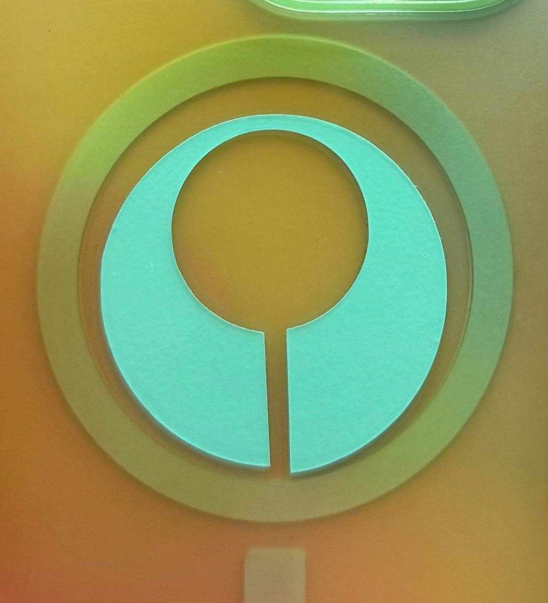

## Optimizar o espaço de armazenamento

Frase-conceito: criar mais espaço para guardar objetos e otimizar a organização do espaço.
## Tecnologias Usadas

Uma ou mais tecnologias estudadas em laboratório:

- [x] Corte 2D (laser / vinil)
- [x] Impressão 3D
- [x] CNC
- [ ] Micro:bit / computação física
- [ ] Outras —

# Autocolante

## Conceito

O segundo projeto foi o que me levou menos tempo e foi feito mais por interesse pessoal do que pela ideia de otimizar o espaço.

É um autocolante inspirado no emblema de um videojogo de que gosto.
## Processo

### Iteração 1 — [Sketch]

**O que tentei:** Uma vez que o programa que utilizamos para o corte é o «Silhouette Studio», o formato de ficheiro necessário é o DXF. Este tipo de ficheiro é mais frequentemente utilizado pelo «Adobe Illustrator», mas, no meu caso, optei pelo «Fusion 360». 

Utilizei a funcionalidade de esboço para criar uma forma inspirada no logótipo de um videojogo.

**O que aprendi:** utilizando um programa diferente do recomendado.

### Iteração 2 — [Silhouette Studio]

Depois de exportá-lo, basta colocá-lo no Silhouette Studio, onde ajustei o tamanho para caber numa folha A4, uma vez que esses são os parâmetros utilizados pela nossa máquina.

A partir daí, bastou escolher a cor do vinil e definir as configurações para esse material na máquina.
## Resultado Final

O resultado final é suficientemente pequeno para caber na capa do meu telemóvel. Como já referi, é inspirado num emblema do videojogo «Marathon».

## Reflexão

Devo dizer que, embora no computador a imagem esteja bem feita, ficou um pouco torta por uma razão que desconheço, mas talvez porque a máquina não tenha segurado o papel com firmeza suficiente.

# Caixa

## Conceito

Há já algum tempo que desejava recriar um jogo de mesa que só fosse possível jogar num videojogo. E como o elemento mais importante desse jogo era um tabuleiro específico, desejei recriá-lo de uma forma que fosse fácil de transportar.

## Processo

### Iteração 1 — [Sketch]

**O que tentei:** Inicialmente, tinha muitos ângulos agudos, mas suavizei muitos deles, pois isso facilitou a impressão pela máquina.

Comecei pela parte inferior; como estou a fazer uma caixa, a forma é simples: basta criar várias caixas e retângulos com a forma desejada. É importante alisar as arestas, se possível, pois isso torna a estrutura mais resistente para a máquina.

Vou usar este mesmo esboço tanto para a parte inferior como para a parte superior da caixa.

**O que aprendi:** eficiência.

### Iteração 2 — [Autodesk Fusion]

Utilizei o Fusion 360 para criar o meu modelo, começando pelo esboço,

Gostaria de salientar que defini os parâmetros de tamanho antecipadamente, uma vez que pretendo que os dados caibam nos recortes quadrados mais pequenos. Assim, no meu caso, baseei todas as dimensões no facto de os quadrados pequenos terem de ter 17 mm, tendo tudo o resto sido adaptado a essa condição. Também anotei as dimensões de tudo em papel, para utilizar na segunda peça no futuro.

É muito importante ter as dimensões corretas, uma vez que fiz três tentativas antes de a impressora ter concluído o meu trabalho; as duas primeiras ficaram demasiado grandes e a terceira não imprimiu corretamente desde o início, pelo que tive de a tornar ainda mais pequena.

Como referi anteriormente, utilizei o mesmo esboço para ambas as peças, mas, neste caso, optei por extrudir os quadrados mais pequenos ao longo da plataforma principal, uma vez que não é necessário que estejam presentes em ambos os lados. Também extrudi as pequenas saliências que servem para fixar a caixa no lugar.

### Iteração 3 — [Bambu Studio]

O passo seguinte é a impressão propriamente dita; utilizei o «BambuStudio» com a «Bambu Lab A1 Mini». E utilizei filamento transparente. As configurações predefinidas do programa são mais do que adequadas para o meu projeto, por isso não alterei nada.

A partir daí, imprimi a base e a parte superior separadamente em duas sessões; felizmente para mim, tudo correu bem. 

## Resultado Final

Este é o aspeto final do objeto;
Tem uma parte superior e uma parte inferior, que se encaixam para ficarem no lugar. A caixa tem capacidade para até 18 dados, uma vez que essa é a quantidade necessária para o jogo.

## Reflexão

Na próxima iteração, dedicaria mais tempo a definir as dimensões de todas as peças, uma vez que, inicialmente, a caixa não conseguia fechar porque as saliências e os orifícios correspondentes tinham dimensões demasiado próximas.

# Prateleira

## Conceito

Uma prateleira que pode ser utilizada para diversos fins, como sapatos, livros, material de arte, etc.

## Processo

### Iteração 1 — [Sketch]

**O que tentei:** O esboço foi provavelmente o que demorou mais tempo; tentei usar parâmetros pela primeira vez, o que fez com que tivesse demasiadas peças interligadas. 

No esboço, é também mais complicado do que a peça final, uma vez que retirei algumas peças desnecessárias.

**O que aprendi:** eficiência.

### Iteração 2 — [Autodesk Fusion]

Utilizei o Fusion 360 para criar o meu modelo, começando pelo esboço.

Para este modelo, como de costume, utilizei principalmente a ferramenta de extrusão e tive de o ajustar várias vezes para que o modelo ficasse com um aspeto «correto». 

Quando terminei, passei pela maioria das fendas com a ferramenta «dogbone», para que a fresa conseguisse cortar os ângulos mais estreitos.

Tive de ajustar bastante o tamanho, porque não conseguimos encontrar um pedaço de madeira adequado. Acho que passei por três versões diferentes, até chegar à versão final.

### Iteração 3 — [CNC]

Embora eu saiba que, por razões óbvias, esta etapa é a mais importante, não posso dizer muito sobre o assunto, uma vez que não estava presente. O professor colocou-o na máquina e, mais tarde, fui buscá-lo.

### Iteração 3 — [Vanguarda]

O último passo foi cortar as pontas soltas e montar tudo. 

Cortei várias peças que não tinham sido cortadas com serra nem alicate. Também lixei algumas das fendas para facilitar o trabalho na etapa seguinte.

Como as medidas eram muito precisas, tive de usar um martelo para montar a prateleira, porque não tinha força suficiente para o fazer com as mãos.
## Resultado Final

Este é o aspeto final do objeto;
Chega até à altura da minha barriga da perna e é muito pesado, mas também resistente. É muito difícil separar as peças, o que o torna difícil de partir.

## Reflexão

A prateleira deveria ter ficado muito, muito mais pequena, mas como precisei de manter a espessura ao ajustar as dimensões, acabou por ficar demasiado grande, o que não reparei durante a fase de modelação

