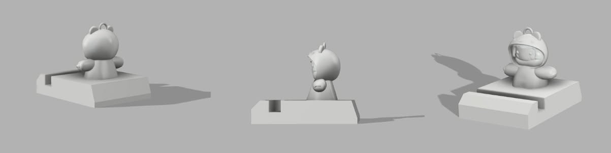
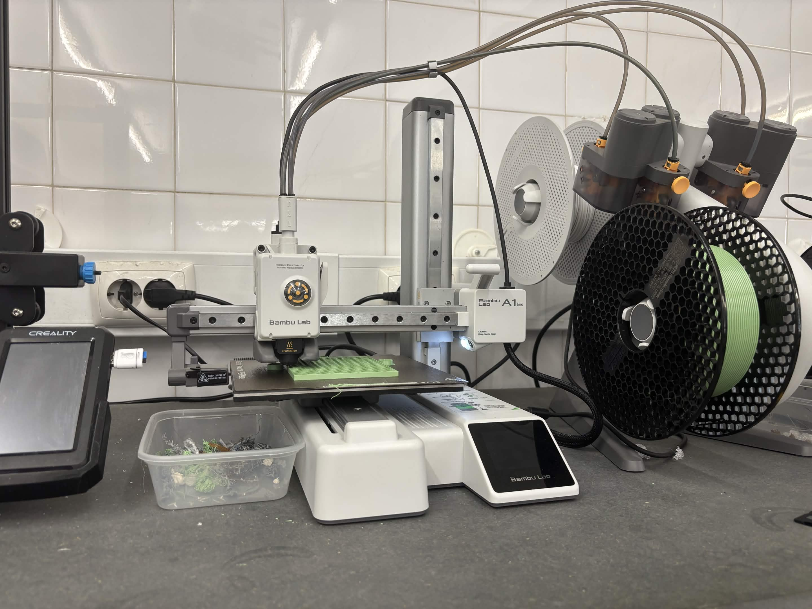

# Chaveiro Mimi

> Cada elemento do grupo deve duplicar esta pasta, renomear para `<numero>-<primeiro-nome>` e preencher.

Frase-conceito: "Mais do que um adereço, uma utilidade diária"

## Conceito

Como nos fora proposto este desafio, decidi começar a explorar as minhas possibilidades e que tipo de produto poderia criar, através da modelagem 3D. Decidi criar um objeto que pode-se utilizar no dia a dia, ou seja, um suporte para o telefone, que também pode-se ser utilizado como chaveiro/decoração. Surgindo assim o "Chaveiro Mimi"

## Tecnologias Usadas

Uma ou mais tecnologias estudadas em laboratório:

- [ ] Corte 2D (laser / vinil)
- [x] Impressão 3D
- [ ] CNC
- [ ] Micro:bit / computação física
- [ ] Outras —

Materiais, software, ficheiros técnicos.

## Processo:

### Conceito/Pesquisa — [título]

**O que tentei:**
Com a ideia já estabelecida, ou seja, de criar um chaveiro/suporte para telefone comecei por esboçar a ideia. Reparei que não poderia fazer uma decoração muita elaborada, uma vez que a base, seria o principal e onde deveria ter um mecanismo que fosse simples e possível de encaixar o telefone.

**O que aprendi:**
Aprendi que a funcionalidade e a estética devem coexistir num projeto, mas nunca uma sobrepor a outra. Além disso, antes de focar no resultado final devo sempre explorar outros produtos similares ao que pretendo criar, de forma a ter uma experiencia do que funciona e do que não, através de um morfograma e desenhos 2D.

### Processo do 2D para o 3D — [título]

**O que tentei:**
Apos o processo dos desenhos em 2D e da pesquisa, iniciei o meu processo para a modelação. Onde optei por utilizar 2 softwares  o "Nomad Sculpt" para o personagem e depois para a base/suporte do telefone foi utilizado o "Fusion360"

**O que aprendi:**
Consegui aprender a utilizar e conjugar 2 programas para o mesmo projeto, uma vez que seriam para funcionalidades diferentes. Além disso, verifiquei que alguns desenhos depois quando se passa para o 3D podem não ficar igual, ou ate mesmo devem sofrer algumas alterações para ser possível, como foi o caso do personagem que optei por fazer só ate ao tronco e não com pernas como tinha desenhado.

**Inicio do Processo de 2D para o 3D**
No "Fusion360" o processo passou-se do seguinte modo: 

1º foi criado um sketch retangular a partir do plano "Direito" com as seguintes dimensões: A - 25mm L-114mm (Como podemos ver na fig.1)

(Fig.1 Fusion360 criação do primeiro sketch)

2º Apos colocarmos as medidas devemos finalizar o sketch e criar uma extrusão para cima com a medida de 88mm com isso podemos clicar onde indica "ok" e finalizamos este processo

(Fig.2 Fusion360 criação da extrusão)

3º Apos o passo anterior vamos criar a abertura para permitir encaixar o telefone, com isso vamos criar outro sketch, a mesma no plano "Direito" a uma distancia, que podemos marcar com o rato, de 19mm. Já referente a medida que será utilizada para o suporte, vai ser um quadrado com a dimensão de: A- 12mm L- 12MM. Com as medidas corretas podemos finalizar este sketch.

(Fig.3 Fusion360 criação do sketch para a abertura do suporte)

4º Agora vamos criar outra extrusão mas para "cortar" este espaço e permitir ter a abertura necessária para o suporte. Ou seja ao criarmos esta extrusão devemos arrastar a seta ate ao outro lado do objeto e automaticamente ela vai "cortar", com isto finalizado podemos clicar no "ok" e avançar.

(Fig.4 Fusion360 criação da extrusão para cortar e criar a abertura do suporte)

5º Novamente no plano "Direito" vamos criar um novo sketch com a finalidade de criar uma maior complexidade no nosso suporte. Neste sketch vamos primeiro no lado frontal do objeto criar uma medida de 9mm e marcamos a mesma com o rato, ao clicarmos depois vamos fazer um angulo de 45º. Ja no lado traseiro do objeto uma medida de 6mm e marcar a mesma com o rato e depois criar uma linha obliqua ate ao fundo criando um efeito de rampa em ambos os lados (frontal e traseiro) e com isto podemos clicar onde diz "finish sketch"

(Fig.5 Fusion360 criação do sketch para efeito de rampa em ambos os lados do objeto)

6º Assim como ja fizemos anteriormente, vamos criar uma nova extrusão para "cortar" onde fizemos anteriormente os sketches, ou seja, vamos clicar nos triângulos que se formaram apos o sketch anterior (ter em atenção que devemos ter o shift premido para ambos ficarem selecionados ao mesmo tempo). Apos termos ambos selecionados, devemos criar então a extrusão e arrastar a seta ate ao final do objeto "cortando" o necessário e criado o efeito que pretendemos e podemos clicar on diz "ok" e finalizar.

(Fig.6 Fusion360 criação da extrusão para cortar e concluir o efeito rampa)

Com os passos anteriores concluímos a primeira parte deste projeto, ou seja, já temos a base do nosso suporte efetuada, agora vamos iniciar o processo para a criação do personagem e inserir o mesmo no que já criamos. 

**Nomad Sculpt**
Já com o  "Nomad Sculpt" o processo passou-se do seguinte modo: 

1º Neste software comecei por criar a base do personagem. Criei um cilindro e achatei o mesmo com a utilizaçao da ferramenta "gizmo", como demonstra na fig.7 assinalado a azul. Apos ter o formato que pretendia utilizei a ferramenta "smooth" em movimentos circulares para lhe dar este ar mais arredondado e liso.

(Fig.7 Nomad Sculpt criação da base do personagem, com um cilindro e assinalado ferramentas utilizadas )

2º Ao finalizar a base, vamos começar a criação da cabeça do personagem, neste caso vamos criar um circulo, depois vamos clicar onde diz espelhar do lado esquerdo e vamos começar por utilizar o "move" e começamos a ajustar o formato de acordo como pretendemos. vamos depois utilizar o "gizmo" para posicionar a cabeça onde achamos melhor e só apos isso, vamos usar o "smooth" para dar um acabamento melhor.

(Fig.8 Nomad Sculpt criação da cabeça do personagem, com um circulo e assinalado ferramentas utilizadas )

3º Concluindo a cabeça , vamos partir para o corpo. Nesta fase vamos criar outro circulo, utilizamos o "gizmo" para ajustar o mesmo e colocar por baixo da cabeça. Já com o espelho ativo, como fizemos antes vamos ajustando para o formato, que e um formato tipo pera, mais arredondado nos lados com a ferramenta "move". Ao estar no formato que pretendemos vamos utilizar o "trim" e cortar a parte de baixo para ser mais fácil o corpo do personagem encaixar na base. 

4º Depois vamos criar outro circulo e outra vez com o "gizmo" vamos colocar mais para cima e a peça que criamos anteriormente, mais para baixo como ´´e demonstrado na fig.9. Quando o circulo que acabamos de criar estiver em cima, vamos ajustar o mesmo com o "move" até ficar parecido com uma gola (uma boa dica será ir rodando o objeto de forma a ver todos os ângulos da forma que criamos) e por fim vamos utilizar o "smooth" para dar o efeito mais acabado. 

(Fig.9 Nomad Sculpt criação da cabeça do personagem, com um circulo e assinalado ferramentas utilizadas )

5º Agora vamos partir, para os detalhes da cara do personagem. Primeiro devemos retirar o espalhado que está do lado esquerdo e apos isso vamos criar dois círculos para fazer os olhos, vamos ajustar com o "gizmo" para colocar do tamanho que pretendemos e depois com o "move" vamos colocar num formato meio plano. Voltamos a utilizar o "gizmo" para colocar na área que pretendemos da cara do personagem e apos isso usamos o "smooth" novamente. 

6º Com os olhos feitos, vamos fazer a boca do personagem, onde vamos criar um cilindro e ajustar o mesmo com o "gizmo". Primeiro comprimindo o mesmo como fizemos com a base e depois colocando mais pequeno. Para finalizar e só posicionar onde pretendemos na cara do personagem e utilizar o "smooth"

7º Como vimos no desenho final, antes de partimos para a modelagem 3D o boneco tinha bochechas e o que vamos criar neste passo. Deste modo vamos voltar a ligar o "espelhado" do lado esquerdo e vamos criar um circulo. Com o "gizmo" vamos diminuir até ao tamanho ideal e achatar o mesmo, quando estiver no formato pretendido vamos ajusta-lo na cara do personagem com a mesma ferramenta utilizada até ao momento e a finalização será feita com o "smooth"

(Fig.10 Nomad Sculpt criação da boca e olhos do personagem, com um círculos e cilindros e assinalado ferramentas utilizadas )

8º Apos finalizar as feições do personagem, vamos fazer o cabelo. Neste caso vamos criar um cilindro e ajustar o mesmo com o "gizmo" quando o mesmo estiver posicionado onde queremos, ou seja, no centro e vamos utilizar primeiro o "mask" e selecionar a parte da frente no formato da cara e depois utilizar o "move" para retirar e ser possível visualizar as feições do personagem. Para concluir na parte superior vamos utilizar o "trim" para retirar e utilizar o "smooth" para suavizar o máximo possível (todos os paços anteriores devemos ter o "espelhar" ativo)

(Fig.11 Nomad Sculpt criação do cabelo, com um cilindro e assinalado ferramentas utilizadas )

9º Agora vamos criar um dos acessórios do nosso personagem, o capacete. Para a criação deste objeto vamos criar um circulo e posicionar com o "gizmo" no centro do personagem. Apos isso, com o "brush" vamos criar a abertura para ser possível ver a cara/cabelo do personagem, apos termos o formato criado com o "brush" vamos clicar no "mask" e só apos isso podemos começar a mover a parte da frente para dentro e depois utilizar o "smooth" para arredondar todo. 

(Fig.12 Nomad Sculpt criação do capacete, com um circulo e assinalado ferramentas utilizadas )

10º Depois de finalizarmos o capacete, vamos decorar o mesmo. Primeiro foram criadas as orelhas. Para a criacao das mesmoas primeiro devemos ligar o espelhado e depois criar um cilindro, quando tivermos o mesmo com o "gizmo" espalmamos o mesmo e posicionamos onde pretendemos. Depois com o "move" vamos ajeitando de forma a dar um ar mais natural e por fim finalizamos com o "smooth".

11º A seguir devemos criar o nariz, onde devemos deixar o espelhado ligado e vamos criar um circulo e com o "gizmo" vamos mover o mesmo ate ambos se unirem (circulo original e espelhado) e quando ambos estiverem juntos, com o "move" vamos ajeitando e por fim utilizar o "smooth"

12º Já para a criação dos olhos, vamos desligar o espelhado e começamos por criar um circulo e diminuir o tamanho do mesmo com o "gizmo" e depois espalmamos o mesmo.  Depois vamos criar outro circulo e fazer o mesmo processo, mas colocando o mesmo mais pequeno e um pouco sobressaído. Vamos por fim utilizar o mover para unir os dois círculos e usar o "smooth" para parecer mais natural e acabado, para concluir os olhos e só posicionar onde queremos com o "gizmo" e fazermos o mesmo processo para o outro olho.

13º Como pretendemos criar um chaveiro, vamos criar a peça para ser possível encaixar a corrente. Para criar a mesma vamos ter de criar um torus e utilizar o "gizmo" para diminuir o tamanho e ajustar ao centro do capacete na parte superior.

(Fig.12 Nomad Sculpt criação dos acessórios do capacete, com um círculos e cilindros e assinalado ferramentas utilizadas )

14º Para a parte final do personagem vamos criar os braços e as mãos. Para este passo devemos ligar a função de espelhado e depois criar um cilindro, que através da ferramenta "gizmo" vamos ajustar e posicionar na lateral do personagem. Com a ferramenta "move" vamos juntar o braço ao corpo e começar a movimentar de forma ao braço ficar mais arredondado, vamos para esse efeito também utilizar a ferramenta "smooth"

15º Para a criaçao das maos vamos criar um circulo (mantendo a funçao de espelhado ligado) e utilizar o "gizmo" para posicionar na parte da frente do braço e vamos utilizar o "move" para colocar uma parte do circulo para dentro e criar este formato de concha, por fim utilizamos o "smooth" para suavizar o aspeto.

(Fig.13 Nomad Sculpt criação dos braços e mãos, com um círculos e cilindros e assinalado ferramentas utilizadas )

Ao seguir estes paços conseguimos finalizar a modelação do personagem, mas para conseguirmos juntar a base que criamos no Fusion360 a este personagem. Devemos primeiro exportar este doc.  Devemos ir a "Files - Export" e clicar onde diz "Export-OBJ" ao termos exportado este doc. devemos abrir novamente o Fusion360.

(Fig.14 Nomad Sculpt modelação 3D finalizada e mostrado como exportar o doc. para OBJ )

**Fusion360**
Como indicado no passo anterior, apos exportarmos o doc. para OBJ devemos ir ao projeto da base que criamos incialmente e clicar no "insert mesh" e selecionar o doc. que exportamos anteriormente. Com o "schale" e o move podemos ajustar o objeto que adicionamos, de forma a encaixar ambos os projetos e criando um só, ou seja o nosso produto final que consiste num chaveiro que serve também como suporte para o telefone.

(Fig.15 Fusion360 inserção do doc.OBJ que criamos no Nomad Sculpt na nossa base criada anteriormente )

### Impressão 3D — [título]
**O que tentei:**
Apos concluir a fase de modelação 3D e renderizar o projeto, vamos passar para a fase da impressão 3D, de forma a ter um protótipo do meu projeto. 

**O que aprendi:**
Aprendi a como configurar/exportar ficheiros (Fusion360" - indo a File - Export - e devemos selecionar a opção 3MF Files.). De forma a ser possível utilizar uma impressora 3d - Bambu Lab A1 mini. 

**Exportação de Ficheiro para impressão 3D:**
"Fusion360" - indo a File - Export - e devemos selecionar a opção 3MF Files. 

**Configuração do "Bambu Studio":**
1º Impressora -  Bambu Lab A1 mini
2º Filamento - Generic PETG
3º Layer Heigth - 0.2 mm
4ºSeam - Aligned

(Fig.16 "Bambu Studio" configuração para a impressão 3D)

Apos configurarmos deste modo devemos selecionar a opçao slice plate e com isto, uma vez que e uma modelação com área que podem cair, ele vai criar automaticamente os suportes necessários para que o que vamos imprimir não caia ou fique danificado enquanto ocorre a impressão ( Ao clicarmos nesta opção também permite também a visualização de quanto tempo levara ate que a impressão seja concluída. )

(Fig.17 "Bambu Studio" inserção dos suportes necessários para a impressão)
 
 Tendo finalizado estes processos, basta colocarmos a pen USB, transferimos o nosso projeto para a pen e depois devemos levar a mesma ate a impressora que vamos utilizar. Ao inserirmos a pen na impressora depois no ecrã vai nos aparecer para começar a impressão.
 

(Fig.18 Fotografia da impressora no inicio do processo)

(Fig.19 Vídeo de demonstração como funciona a impressão 3D)

## Resultado Final

Imagens bem produzidas do produto/objeto/intervenção final, com texto explicativo.

## Reflexão

Se tivesse a possibilidade de explorar mais a modelação/ impressão em 3D novamente, iria criar modelações mais simples de forma a poder imprimir mais vezes e conseguir ter uma maior noção de como melhorar a minha modelação e consequentemente aprender mais sobre impressão. 
 Além disso, também iria me permitir explorar mais o corte em vinil e como integrar o mesmo em projetos de impressão 3D.  Já especificamente a este projeto se tivesse feito mais impressões talvez poderia erra mais cedo ou ate fazer algumas alterações de forma a enriquecer o processo. 

