# Deadlocked

Frase-conceito: Prende o cabelo como uma tranca

## Conceito

Para este projeto pensei primeiramente num acessório que me fosse útil. Rapidamente apercebi-me que faria sentido fazer um objeto para usar no cabelo. Procurei algumas inspirações e senti  que faltava algo aos acessórios de cabelo comuns. Assim, decidi juntar à minha ideia o símbolo de uma personagem de um jogo, a Deadlock. Escolhi esta personagem pelo seu poder especial, o Sonic Sensor, que funciona como um sensor que trava os inimigos. 

Fig. 1 - Personagem Deadlock do Valorant

Fig. 2 - Sonic Sensor, Símbolo do Poder da Deadlock

Da mesma forma, este acessório de cabelo tem a mesma forma e elementos e necessariamente prende o cabelo para que ele não caia, o que cria uma mensagem intuitiva à função do objeto.

É importante mencionar que este projeto surgiu a partir das minhas ideias iniciais: uma máquina de costura manual que seria como desenhar mas a coser e mais tarde, a ideia de cartas de tarot impressas em 3D, o que impulsionou as possibilidades criativas, especialmente em direção à funcionalidade tridimensional.

Fig. 3 -  Esboços da Máquina de Costura
## Tecnologias Usadas

Uma ou mais tecnologias estudadas em laboratório:

- [x] Corte 2D (laser / vinil)
- [x] Impressão 3D
- [x] CNC
- [ ] Micro:bit / computação física
- [ ] Outras —
## Processo

### Iteração 1 — [Sketch]

Comecei por criar um ficheiro híbrido no fusion e desenhei um círculo com um diâmetro de 7 cm ao centro no plano horizontal e outro diâmetro à volta sem medidas.

De seguida, escolhi a medida do círculo interior até ao exterior com uma margem de 1,50 cm.

Agora que já tenho a forma principal crio a espécie de losango que está a volta deste círculo. Sendo assim, desenho primeiro uma "Conic Curve" sem uma distância exata do círculo exterior e com um ângulo da curva de 0,5 cm.

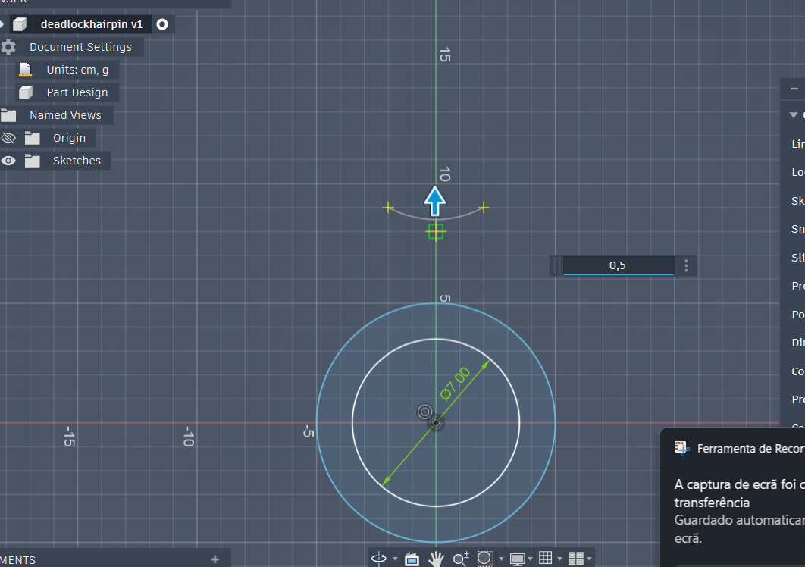

Para não ter que fazer denovo em todos os lados, usei o circular pattern com para repetir esta curva como objeto quatro vezes com o center point da origin.

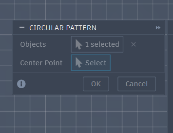

Para juntar estas curvas, criei mais outra Conic Curve com 0,6 cm de  ângulo da curva conectada pelos pontos exteriores das curvas criadas anteriormente e usei mais uma vez o circular pattern.

Entertanto, queria criar os cortes interiores do símbolo e fui fazendo algumas tentativas repetidas sem qualquer tipo de medidas que fossem necessárias até acertar na distância que achava adequada.

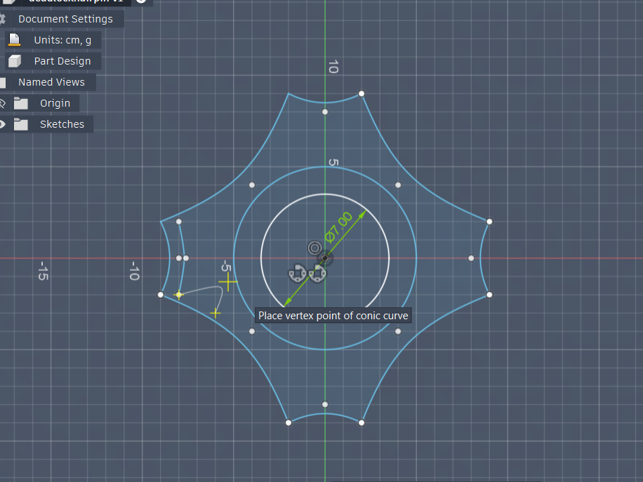

Após chegar à forma adequada adicionei o corte inferior, tentando seguir o formato similar do círculo exterior. Adicionei a curva com um ângulo de 0,75 cm.

Conectei as partes laterais desta forma curva com um ângulo de 0,5 cm e usei o Mirror para evitar criar outra curva. Logo de seguida, uso novamente o circular pattern quatro vezes já com a forma concluída.

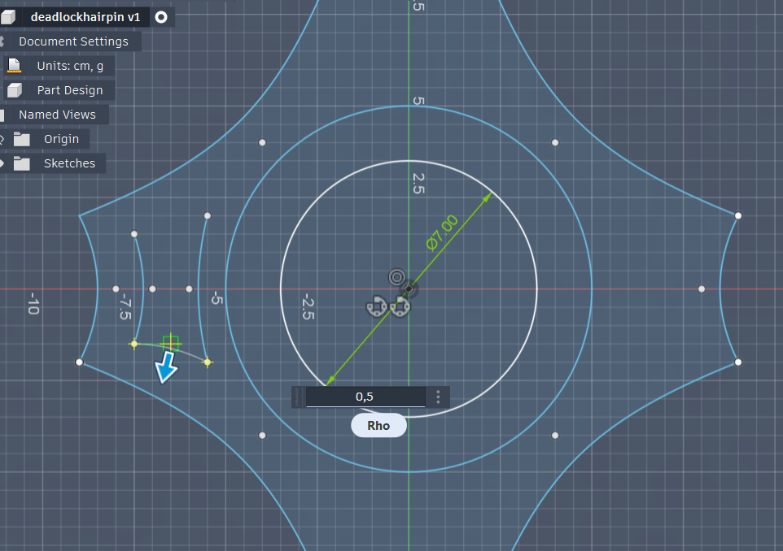

E assim fica concluída a parte do sketch da forma principal. 
Para fazer o outro objeto que se prende a esta forma fiz um sketch que depois foi descartado porque como eram formas simples já existiam em modo 3d. 

Sendo assim decidi mostrar na mesma esta parte do processo:

Criei um círculo de 4 cm de diâmetro.

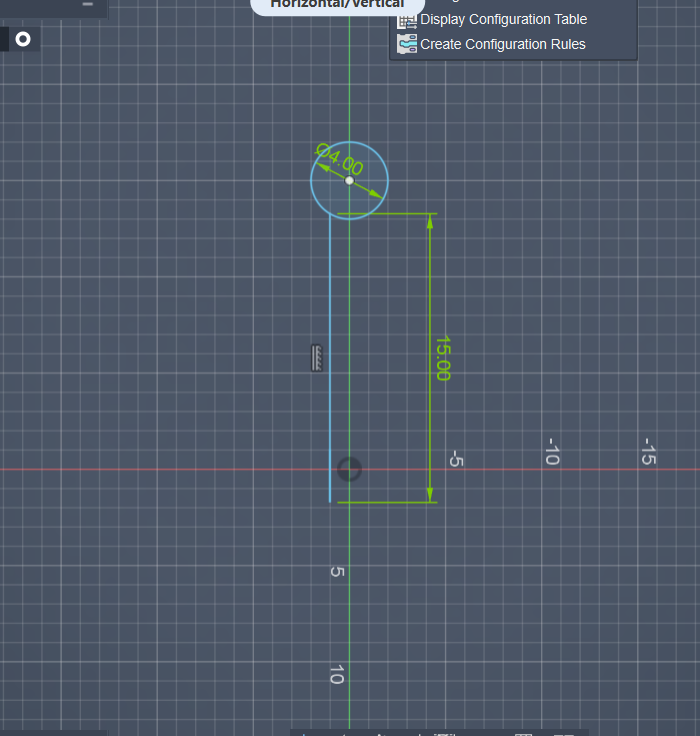

Depois uma linha com 15 cm tangente ao círculo, mirror da linha e depois criei um círculo igual que iria deixar tangente à linha.

**O que tentei:** Para a forma principal tentei não complicar muito com formas irregulares ou assimétricas. No fundo que fosse algo intuitivo e sem muitas restrições para ser feito sendo que não exigia esses aspetos para a sua função. Tentei pensar num acessório que tivesse um conceito interessante aplicado à construção e no processo em geral. Adicionalmente tentei fazer um sketch para um objeto que era 3d mas que seria simétrico para os dois lados.

**O que aprendi:** Aprendi que por um lado fazer as coisas mais simplificadas ajuda mas cria problemas de gestão mais tarde. Em aspetos que, por exemplo, poderia ter criado a forma 3d na mesma através do sketch mas preferi evitar pela complexidade, sendo que seria só extrudir para os dois lados simetricamente. No fundo poderia ter feito uma melhor gestão de tempo para não ter que pensar tão rápido na aplicação prática deste projeto. Aprendi que também é extremamente complexo fazer formas concavas e sem partes conectadas através do esboço.

### Iteração 2 — [Modelação 3D]

Continuando pela narrativa do segundo objeto, decidi criar diretamente sem esboço: criei duas esferas com 4 cm e um tubo com 15 cm.

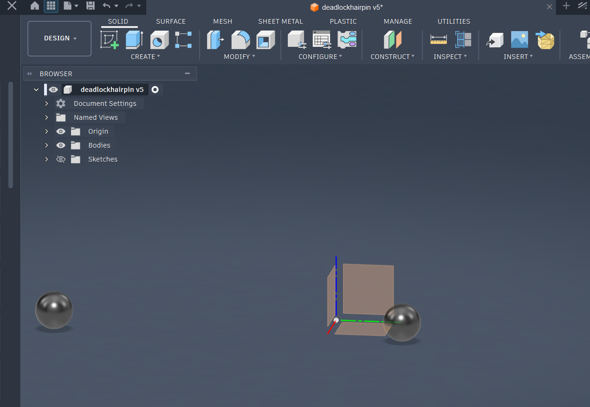

Como não tinha restrições no 3d tentei mover as esferas até estarem sobrepostas pelo tubo, ou seja, para que fiquem presas de forma segura, para quando usar o combine ficar como um objeto só sem quaisqueres gaps.

Com este objeto concluído, dei extrude no sketch da outra forma com 3 cm de espessura.

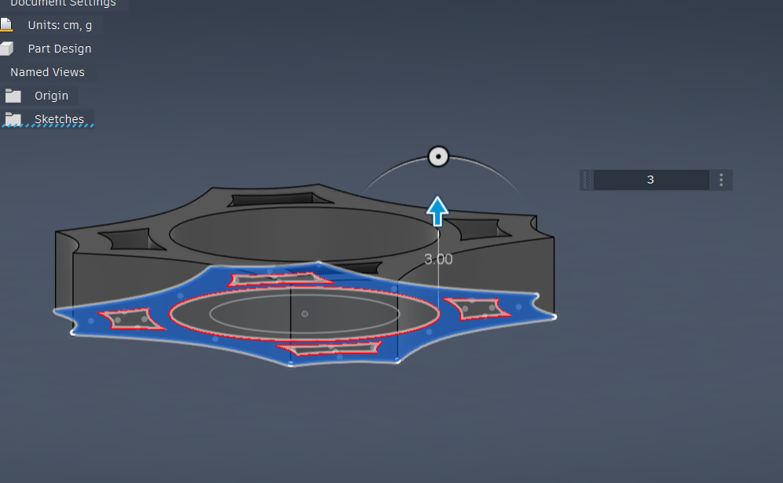

Usei o Fillet para adicionar tridimensionalidade lateral com o Radius Type em Constant e como Setback com 0,4 de Fillet e outro na parte do círculo do meio.
Adicionalmente comecei a ver como é que se iria compor os dois objetos juntos, se seriam tangentes ou com uma espécie de intersecção com o mover. É importante mencionar que cortei o segundo objeto do tubo ao meio, para poder criar simetria com o Mirror mais tarde.

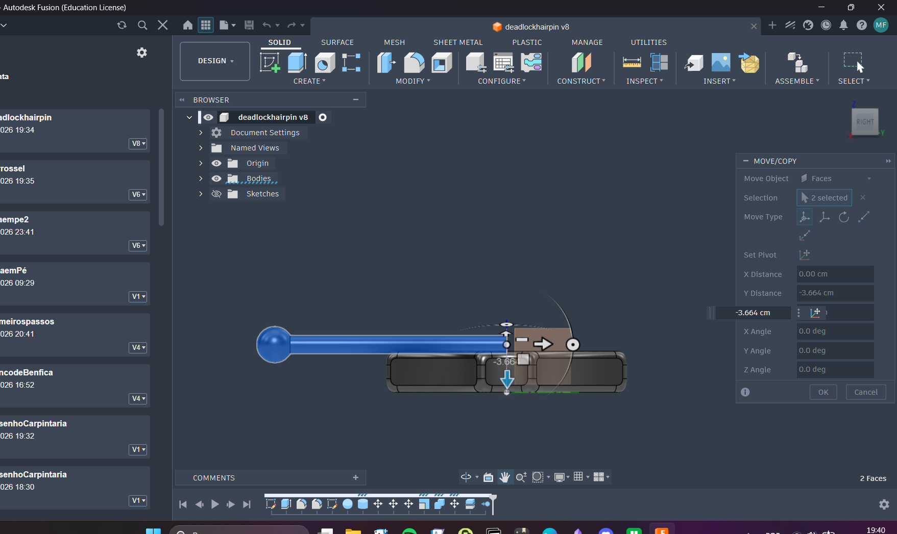

Mais tarde voltei a separar os objetos porque me apercebi que teriam que ser separados para conseguir agarrar ao cabelo de forma consistente, mudei também o tamanho dos objetos para não ficar tão grande na impressão 3d e ter a certeza que seria adaptado ao cabelo. Sendo que na aplicação só tem scale sem redução com números exatos.

**O que tentei:** Tentei criar tridimensionalidade para além do extrude, senti que se ajustava mais à linguagem gráfica do símbolo se adicionasse o Fillet. Tentei criar as esferas e o tubo como forma de facilitar o processo de junção mais tarde.

**O que aprendi:** Aprendi que deveria ter feito a parte 3d do segundo objeto a partir do sketch porque até esta parte não sabia se estava simétrico, porém como mais tarde cortei o objeto ao meio e usei o Mirror já ficou simétrico. Apesar de não ter muito conhecimento sobre este tipo de acessório de cabelo ao ver os exemplos na biblioteca online do Bamboo pensei que os objetos eram colados um ao outro, por isso mais tarde tive de fazer pesquisa extra, o que teria sido desnecessário se tivesse feito pesquisa extra. Também descobri que apesar de muitos destes acessórios terem uma forma concava para se adaptar à cabeça, é extremamente difícil criar esta curva a não ser que crie o objeto no plano frontal ou use uma tool num programa de esculpir como o Blender.

### Iteração 2 — [Preparação do Ficheiro]

Começei por salvar os corpos do fusion como mesh com formato STL.

Porém ocorreu-me um erro na Bambu Studio, no qual as peças ficavam com 6 horas de duração não importava o tamanho que tivesse ou a complexidade do ficheiro. Por isso tive de exportar as duas peças novamente mas desta vez em formato OBJ.

Mudei também algumas definições da máquina com as instruções do professor. Inclusive o filamento da máquina sendo que queria outro em vez do que estava na máquina.

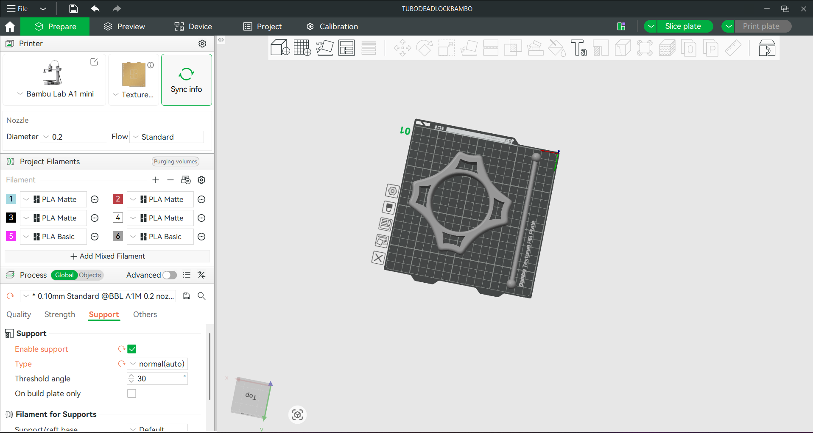

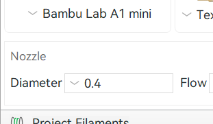

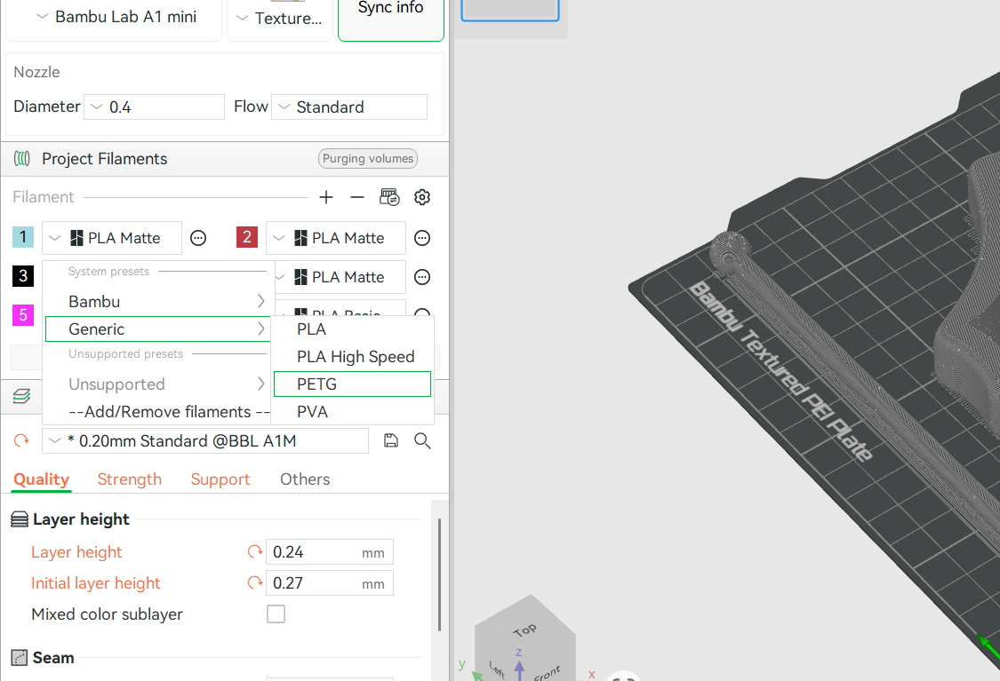

Por fim exportei o Plate para a pen e inseri na máquina.

## Resultado Final

Imagens finais do objeto impresso com o fundo removido.

Aplicado no cabelo:

Este objeto foi impresso com uma costura quase invísivel (em todo o lado do objeto) em vez de só uma parte do objeto, o que contribuíu para uma textura mais áspera, que inclusive se adapta a cabelos mais escorregadios e permite uma maior adaptação sem causar desconforto.
## Reflexão

Em relação aos objetos como um todo, acho que um aspeto muito importante é o tamanho e a forma que se compõe. Acredito que faria sentido ter um tamanho mais diminuído para não ser tão pesado apesar de não cair com muita facilidade. Gostaria de ter realizado este objeto com uma concavidade para ser menos conceptual e mais funcional no quotidiano. Também teria sido interessante explorar pintar ou personalizar este objeto ou até mesmo fazer outras versões possíveis.

Acredito que correu bem e no fim até ficou bem executado. Na minha opinião, aspetos como o tamanho, o filamento, a textura e o formato intencionalmente ajustaram-se à forma que uso as coisas: no sentido em que acessórios de cabelo costumam ser desconfortáveis para mim e por este objeto ser tão grande e solto, permite um conforto incrível para espaços que não exigem muito movimento. Até mesmo a questão de ser impresso em 3d: o material contribuí para a temperatura sendo que por ser fresco ainda adiciona mais conforto ao seu uso.

# Harmonia em Movimento

Frase-conceito: Brinquedo de equilíbrio que cria movimento entre as peças e os utilizadores.

## Conceito

Este projeto começou por surgir através da proposta Nestor para a disciplina de Design de Produto III.  Usei esta oportunidade para criar a minha maquete final.

 "O **Projeto NESTOR** é uma iniciativa de investigação que explora a interseção entre sustentabilidade industrial, design e fabricação digital. No seu núcleo, o projeto visa desenvolver um sistema inteligente que otimize a utilização de material excedente da indústria do mobiliário, através da inserção automática de pequenos brinquedos de madeira nas áreas não utilizadas dos planos de corte CNC."

 Usei como base para construir este projeto um mooboard criado em conjunto com o meu grupo de Produto. 

Este projeto teve diversas fases a partir do momento em que era um jogo de encaixes, um carrossel, um jogo de equilíbrio até chegar a esta proposta. 

Fig. 1 - Prancha-Resumo Inicial

O conceito deste jogo começou a florescer depois de realizar esboços sobre a ideia e possíveis mecanismos.

Fig. 2 - Esboços Rápidos da Ideia 

Fig. 3 - Esboços em Detalhe

Fig. 4 - Prancha Resumo do Conceito Finalizada

## Processo

### Iteração 1 — [Maquete 1]

Como não conseguia avançar com esta ideia por já ter desenvolvido tantas ideias antes, tentei fazer uma maquete extremamente simples com cartão e fita-cola.

**O que tentei:** Tentei iniciar o projeto e avançar com o meu conceito.

**O que aprendi:** Aprendi que foi extremamente essencial para começar a perceber os mecanismos do objeto e a sua função como brinquedo.

### Iteração 2 — [Modelação 3D - Maquete 3D]

Após criar o meu ficheiro híbrido no Fusion adicionei os parâmetros.

Desenhei um círculo para a base com o primeiro parâmetro de 200 mm.

Depois usei a extrusão na base com a minha espessura geral: 19 mm. Na mesma base, desenhei outro círculo de 80 mm.

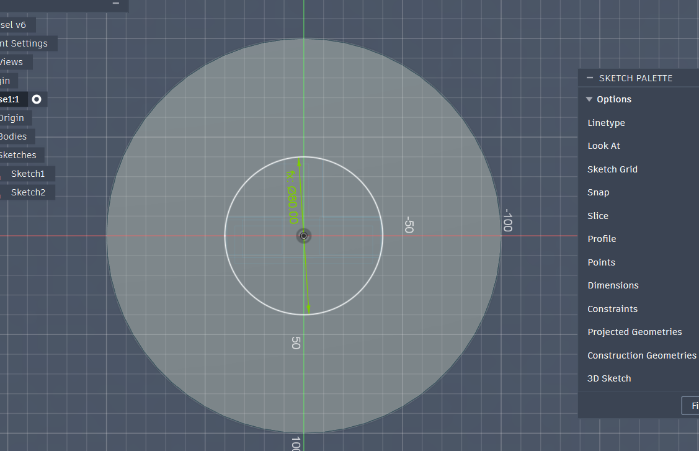

Neste mesmo círculo criei dois retângulos que depois deixei tangentes ao círculo de forma simétrica com a medida da espessura (19 mm). Depois deste passo usei a extrusão num dos retângulos.

Criei um corte inferior com 25,95 cm que depois extrudi como corte.

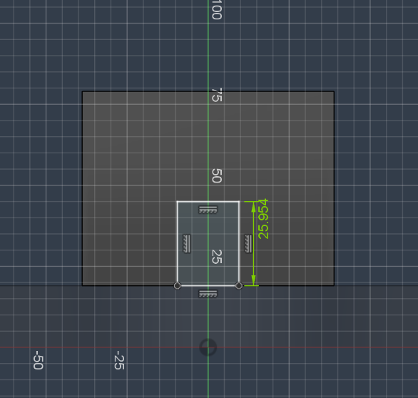

Usei a extrusão no outro retângulo também e desta vez criei um corte na área superior com a mesma medida e usei a extrusão para cortar a peça novamente. Depois destes passos usei o combine nas duas peças.

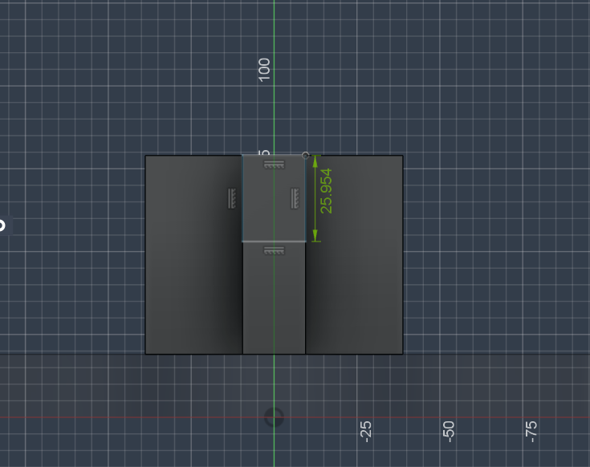

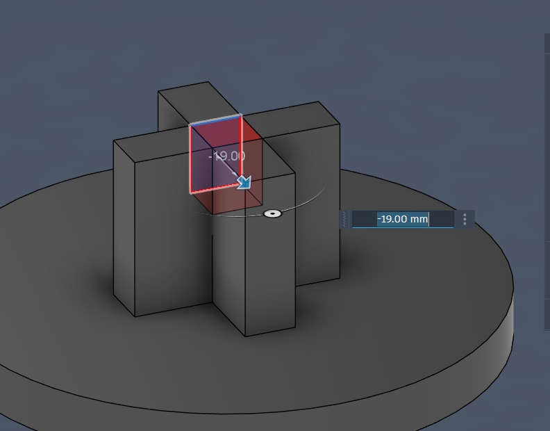

Criei outro círculo com 100 mm e usei o para criar um buraco na base à volta das peças. De forma similar criei outro círculo igual mas desta vez por cima das peças, que depois acrescentei a espessura com a extrusão.

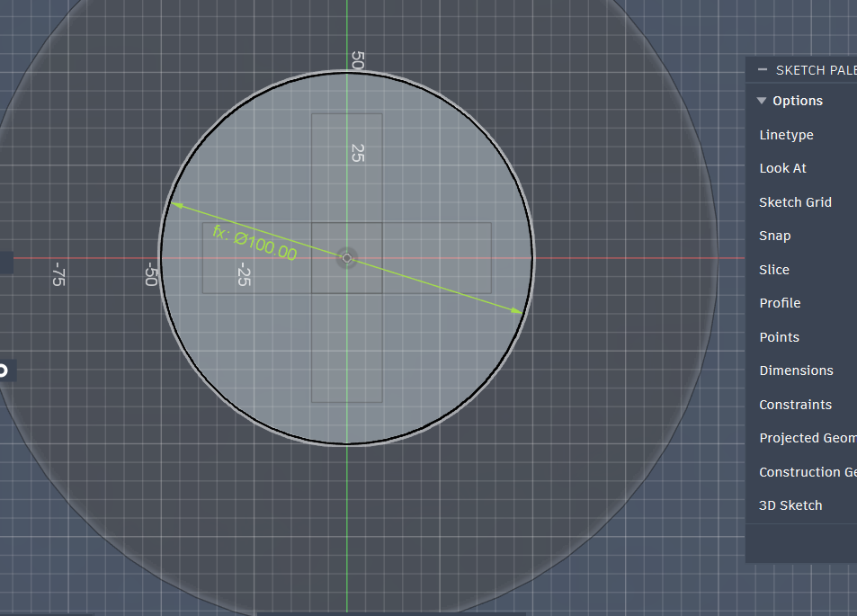

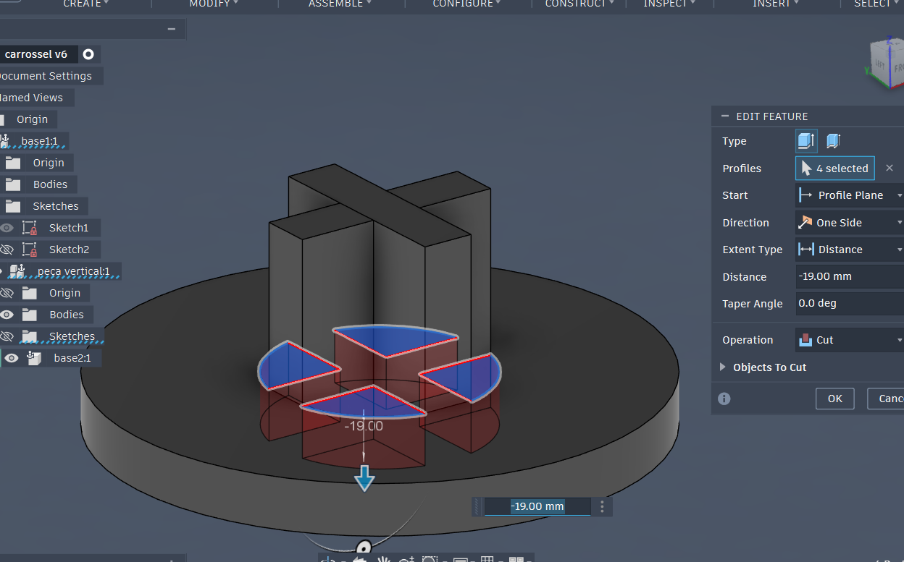

Criei outro esboço na base debaixo com uma peça que extrudi com a espessura para depois criar as outras peças com o circular pattern que circulam esta base.

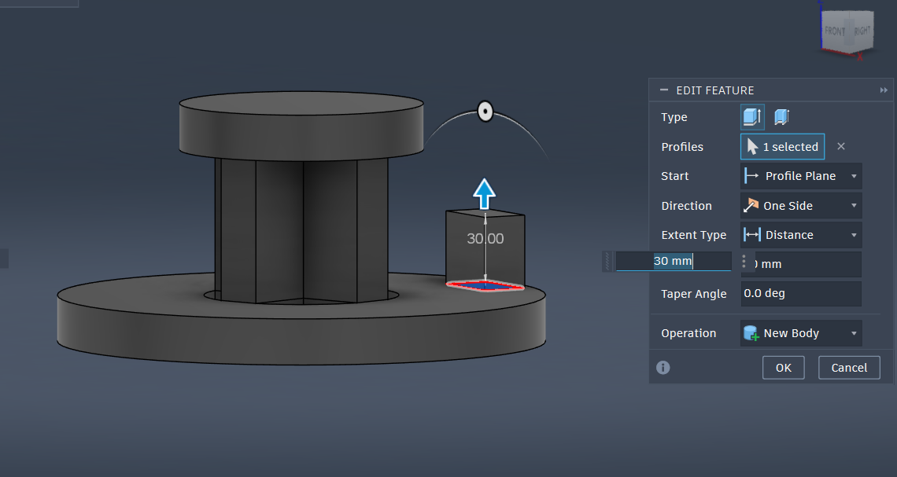

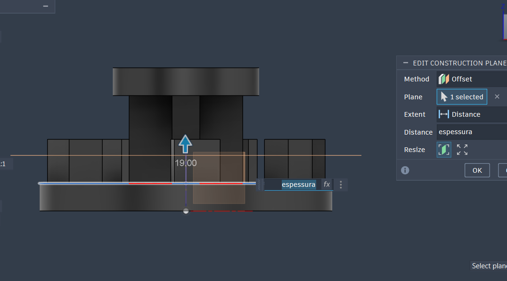

De seguida criei um círculo nesta base de construção na imagem interior. Fiz um círculo que quase não tocasse nas peças e extrudi para cima com a espessura. De seguida criei outro esboço tangente a esta base e extrudi com a mesma grossura desta base para baixo. Por fim adicionei o combine para esta alavanca ficar junta a esta base circular.

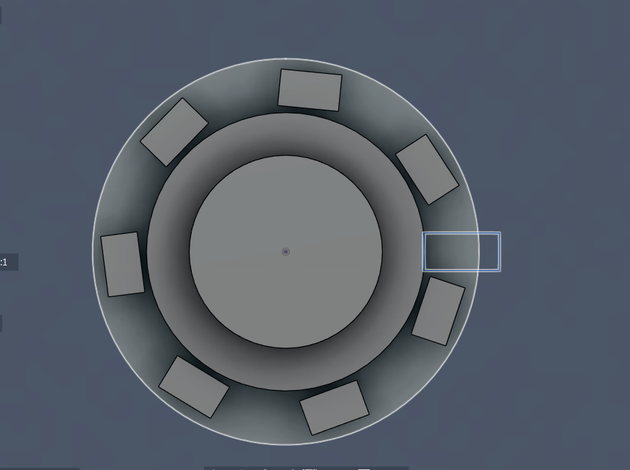

Acabei por realizar outra maquete 3d que não resultou tão bem mas que é composta pelos passos similares da maquete final, o que muda são os parâmetros e a dependência entre os corpos do objeto.

**O que tentei:** Tentei simplificar as formas ao máximo só para ter um modelo 3d para perceber a construção ideal para o meu modelo 3d. Criar um bom equilíbrio entre o tamanho das peças.

**O que aprendi:** Aprendi que esta não era a melhor opção porque todas as peças exigiam extra bases para as segurarem. Tive de pensar noutras soluções e quando tentei dispor esta segunda maquete final para a CNC percebi que não ia funcionar pelas partes com menos de 5 mm e pelos apertos.

### Iteração 3 — [Maquete 3]

Esta maquete foi criada tanto para poder experimentar fisicamente as proporções como para testar a sua funcionalidade.

Algumas fotos do esboço inicial para poder maquetizar as medidas.

Para poder ficar fiel ao projeto em todas as peças tive que colar 3 pedaços de cartão para ficar com a mesma espessura.

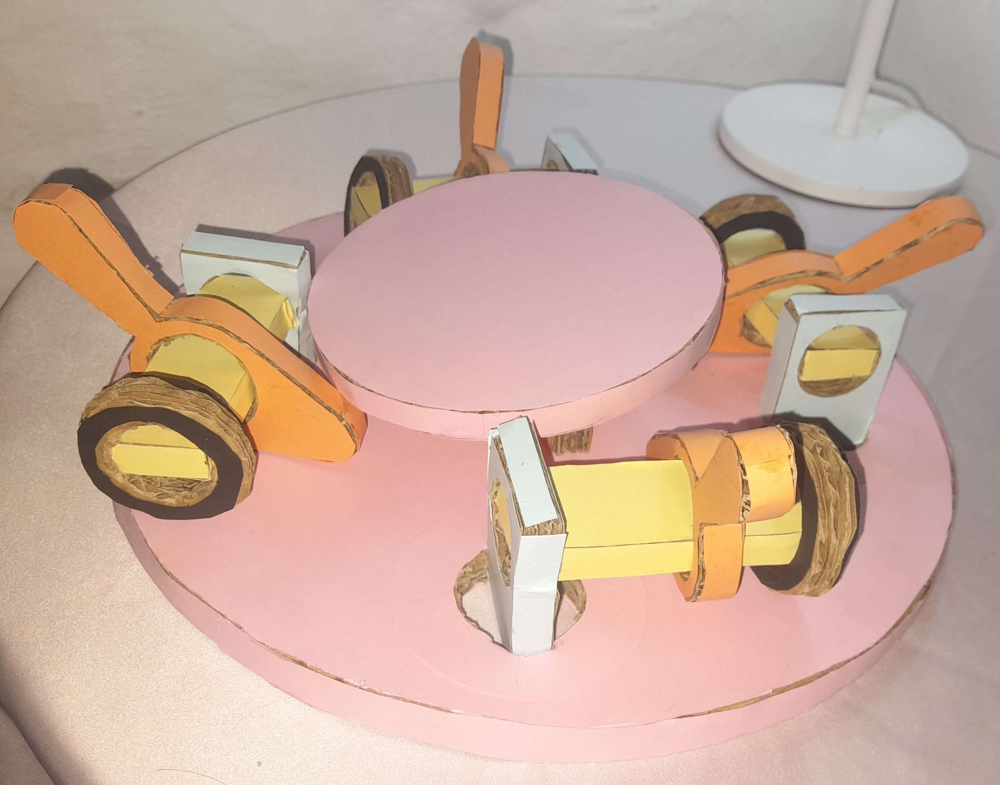

**O que tentei:** Tentei ser fiel ao máximo e ajustar as medidas como achava que deveriam ser detalhadas.

**O que aprendi:** Aprendi que apesar de a maquete ter corrido bem que o material causa problemas com as medidas sendo que a cartolina e o cartão são moderadamente mais ágeis do que mdf.

### Iteração 4 — [Maquete 4]

Comecei pelos parâmetros:

(Todas as medidas são editadas com a matemática do Fusion, por este motivo vou evitar mencionar-las). Depois de já ter criado um círculo para a base, criei um esboço de um círculo na mesma base. usei a extrusão e usei o circular pattern. Neste mesmo esboço desenhei um retângulo tangente ao círculo que depois extrudi com a espessura da base (1,2 cm) para baixo.

Desenhei também no plano frontal em cima da base metade de uma curva com 3,50 cm de altura e 4 cm de largura que dupliquei para o lado com o Mirror. Depois desenhei um corte inferior de 1,75 cm de altura e 1,20 cm de largura com as medidas divididas pela linha central.
e outro de uma curva que depois usei o mirror. Mais tarde usei a extrusão e desenhei outro igual que extrudi e criei um corte igual por cima que depois com o combine ficaram os dois encaixados.

Com aqueles retângulos extrudidos da base, extrudi para cima novamente com 4,80 cm ( a partir de um comprimento, 3 cm, menos a espessura)

Depois esboçei centrado em cada um destes paralelepípedos um círculo com 2,98 cm (tem uma folga de 0,2 mm) e adicionei outro retângulo dentro deste círculo com a espessura de largura e 2,70 de largura com os vértices tangentes ao círculo (pode ter folga).

Extrudi em corte com a espessura em todos estes paralelepípedos. 

Usei o retângulo anteriormente desenhado e extrudi com o seu comprimento: 9 cm. De seguida usei o circular pattern quatro vezes para adicionar aos outros elementos.

Depois desenhei na ponta do paralelepípedo o círculo para a tranca que não permite as outras peças se mexerem. Extrudi para dentro com a espessura e voltei a usar circular pattern.

Depois criei um plano de construção e desenhei no meio do paralelepípedo no plano lateral a minha alavanca. começo por fazer o círculo interior com a respetiva folga e o exterior com 3,01 e 3,50. De seguida desenhei uma linha do ponto central do círculo com 4 cm até à tangente do círculo da direita que tem 1,50 e situa-se abaixo da base superior. Do mesmo ponto central meço verticalmente 3 cm e 5,50 cm de largura até ao centro do nosso próximo círculo à esquerda. Este círculo tem 2,00 cm. Crio uma linha de apoio desde o ponto central do círculo de 3cm até ao centro do de 2,00 cm. faço uma linha tangente aos dois círculos que tem uma margem de 0,50 até à linha da simetria. Por fim, duplico com o Mirror esta linha e extrudo esta forma toda com a espessura toda a parte interior do círculo onde está o paralelepípedo. Volto a usar circular pattern para repetir quatro vezes.

Para criar a base superior faço um esboço dum círculo a partir de um plano de costrução com a altura das formas cruzadas que estão debaixo.

Para prender as primeiras formas cruzadas criadas depois da base extrudo com a espessura até à base e uso o combine e keep tools para fazer um buraco. Para ficar justo, adicionei dogbones.

No planeamento para a CNC não fiz arrange e fiz align, o align não ficou perfeito e ficou tudo desalinhado com a placa do ficheiro. Para cortar este ficheiro e definir as definições da fresa e outras questões para a CNC tive a assistência do professor. Usei uma placa de 12 mm.

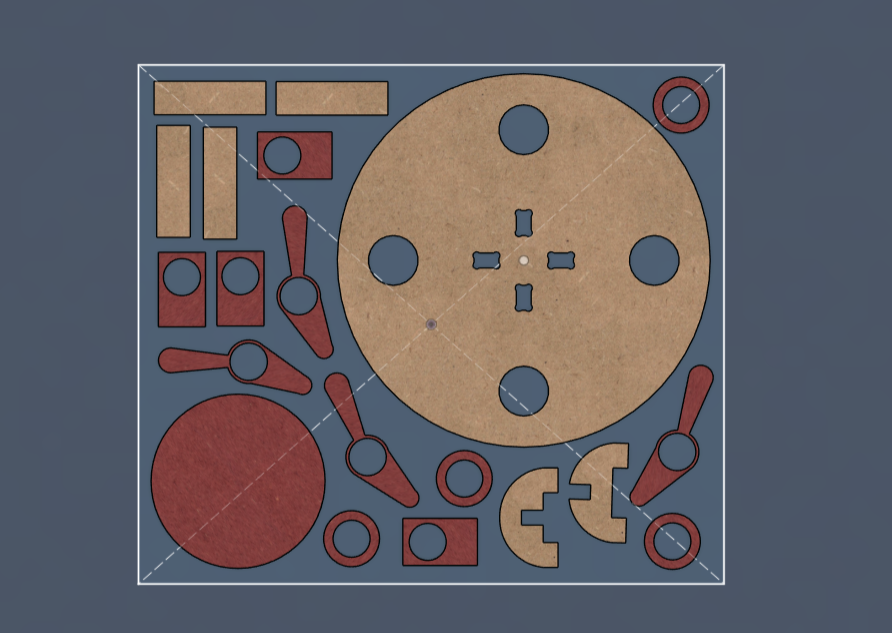

RENDERS:

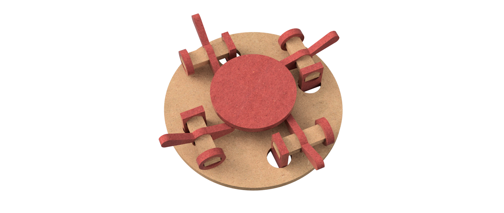

**O que tentei:** Tentei com que ficasse com um design organizado para a sua funcionalidade. Tentei evitar erros ou que o objeto se pudesse partir quando fosse cortado pela CNC.

**O que aprendi:** Aprendi que mesmo que use no minímo 5 mm as peças têm tendência a serem muito sensíveis por causa do material, a forma que é cortado ou até como se separa as peças. Aprendi que é preciso verificar sempre os ficheiros e ter experiência com manufaturação quando se trata de transmitir o objeto exatamente como é pensado.

## Resultado Final

Foto da placa depois de ser cortada:

PEÇAS INDIVIDUAIS:

PEÇA 1 4X

CONECTOR 4X

BASE 2 1X

ALAVANCA 4X
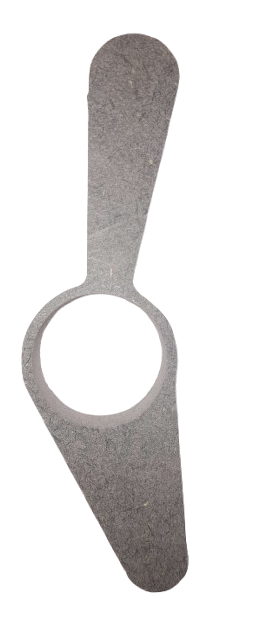

Maquete cortada em CNC finalizada. A base superior fica estável mas o resto dos elementos com os encaixes estão desproporcionais e soltos.

Demonstração do movimento:

## Reflexão

Faria as coisas com mais planeamento e com menos divergência de ideias. Por ter explorado tantas coisas não tive tempo de fazer parâmetros mais detalhados nem um objeto mais complexo ou com outras personalizações. Acredito que a parte da CNC correu mal porque nada encaixava e estava tudo muito solto ou muito apertado devido às folgas dos círculos.

Gostaria de pensar neste projeto futuramente como base de fundamento para outras ideias.

# Pixel

Frase-conceito: Pixelar o que emerge.
## Conceito

O projeto Pixel surgiu a partir do nome do meu animal de estimação, o meu gato. Pensei em criar uma "catch phrase" a partir do nome do meu gato sendo que a tecnologia usada para este projeto requer simplificar formas durante o processo.

## Processo

### Iteração 1 — [EDIÇÃO]

Primeiramente recolhi as imagens dos meus dois gatos (editei a primeira  foto a preto e branco) e juntei-as e comecei a cortar à volta.

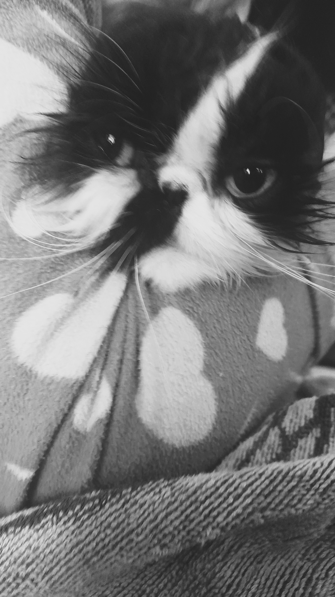

Comecei por tentar pintar o gato na esquerda. Porém rapidamente me apercebi que não ia conseguir simplificar as cores por ter misturas de cores tão complexas.

Até este momento estive a usar o programa de desenho Krita para desenhar por cima mas ia ser difícil de fazer como vetor por isso passei para o Illustrator. Como a pixel só tem duas cores tentei simplificar as formas. Processo de pintura com a caneta do Illustrator:

**O que tentei:** Fazer duas figuras com cores distintas num programa de pintura
**O que aprendi:** Não se adequa como ficheiro par a Silhouette, têm que ser simplificadas as formas ao máximo para ter sucesso em como se retira e fica mais tarde.
### Iteração 2 — [Preparação e Corte]

Inicialmente a imagem estava muito grande então tive de diminuir o tamanho. Exportei como DXF. Destranquei a patilha, depois pus o Vinil encaixado na máquina Mudei as configurações para Vinil, fosco e liguei o computador à máquina.  Quando concluído carreguei no botão Descarregar e retirei da máquina o vinil.

Depois de ter o meu vinil pronto usei um material autocolante para arrancar as formas. Porém ficou mal colado e dificultou o processo.

**O que tentei:** Fazer duas figuras com cores distintas num programa de pintura
**O que aprendi:** Não se adequa como ficheiro par a Silhouette, têm que ser simplificadas as formas ao máximo para ter sucesso em como se retira e fica mais tarde. Formas em espinho ou finas dificultam o processo. Formas sobrepostas causam cortes extra sobrepostos no vinil e dificulta o processo de retirar as formas. Espaços apertados ou pequenos têm tendência a divergir para o lado ou ficarem mal cortados.
## Resultado Final

Imagem Final da Pixel do autocolante colado a uma folha.

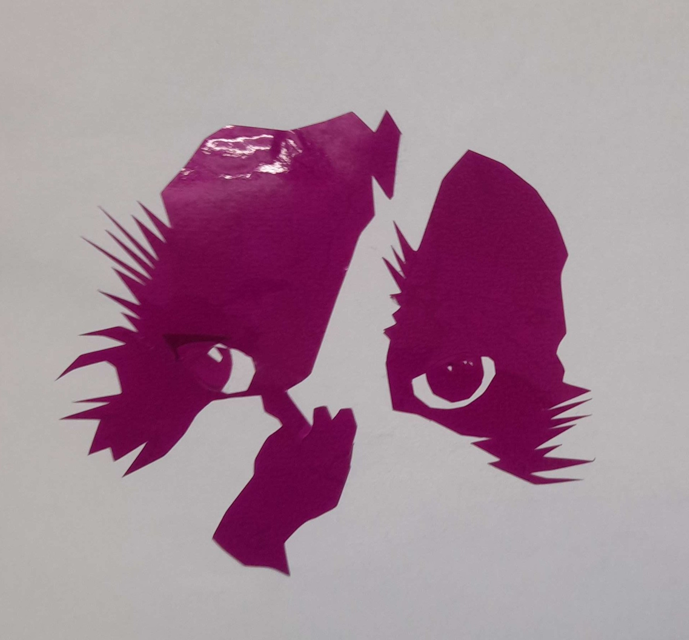

## Reflexão

Se fizesse alguma coisa diferente seria poder ter feito mais experiências para compreender como a máquina trata a cor, o corte e o material. Não percebi por completo como a cor se comporta na máquina se for utilizada de formas diferentes. 

Gostaria de ter experimentado mais cores e formas mais de silhueta, sendo que esse é o intuito da máquina. Acredito que deveria ter sido mais sensível com o material porque esperava que fosse mais resistente. Acho que só houve uma coisa que falhei e foi o tratamento da parte oposta da cor: o branco, sendo que ele não existe na folha e causa algumas incoerências.

