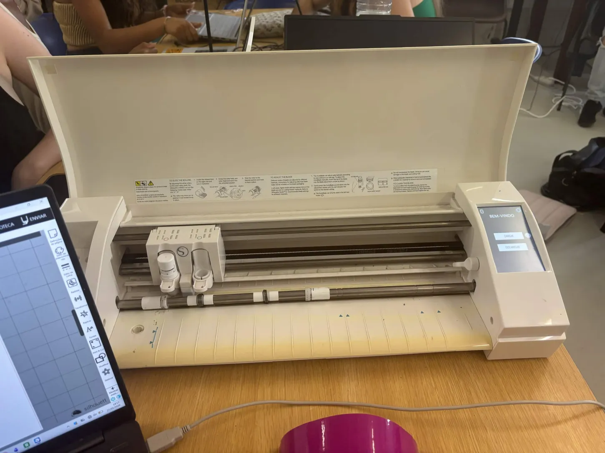

# Silhouette Cameo

> Frase-síntese: é uma plotter de corte digital, utilizada para cortar com precisão materiais como vinil adesivo, papel e cartolina. É um equipamento utilizado para personalizar produtos e prototipagem rápida de autocolantes.

Tutorial elaborado pelo grupo seguindo a estrutura de referência (ver tutorial CNC do Fablab Benfica como modelo: <https://fablabbenfica.gitlab.io/fablabbenficadocs/machines/ouplan/>).

## 1. Como desenhar para esta tecnologia?

Para desenharmos para esta tecnologia devemos utilizar o **Adobe Illustrator** numa folha A4  horizontal, para converter os traços em vectores. 
Tendo sempre em atenção que as formas utilizadas devem ser geometrizadas continuas e simples, para ser mais fácil retirar do material onde ocorreu o corte final da máquina e também não ocorrerem linhas sobrepostas entre si, uma vez que agulha não transpassa o material e só corta a superfície do mesmo. 
 
Devemos também ter em atenção que cada sticker que criarmos deve estar em layers diferentes. E uma vez que estamos a usar uma folha A4 devemos ter em atenção de deixar uma margem de segurança de 1 a 2cm. Apos isso e termos as nossas formas finalizadas devemos fazer um retângulo do tamanho da folha.

## 2. Como preparar um ficheiro para a máquina

Após termos finalizado o nosso trabalho no illustrator devemos exportar o mesmo através de "File - Export as - e exportar como DXF". Ao termos exportado o nosso ficheiro, devemos abrir a aplicação "Silhouette studio" e clicamos onde diz "Design" com isto vamos importar o ficheiro que criamos anteriormente e inserir o mesmo na área do design.

- Software: Adobe Illustrator e Silhouette Studio
- Formatos de ficheiro: DXF
- Settings principais:**1º** No Adobe Illustrator "File - Export as - e exportar como DXF";
**2º**Abrir o  "Silhouette studio" e importar o nosso ficheiro DXF para a área do "Design"; **3º**  Clicar em "Enviar" e definir com as seguintes informações "Vinil Fosco", "Cortar" e "AutoLamina".

("Silhouette studio" preparação final do doc. para enviar para a máquina e começar o processo de corte do vinil)

## 3. Antes de Começar

### 3.1. Segurança

Ao termos a primeira parte pronta, vamos preparar o equipamento, tendo sempre noção das normas de segurança. Este equipamento não exige óculos ou proteção ocular, por ser um equipamento silencioso e de pequena dimensão.  Mas recomenda-se prender o cabelo, evitar roupas com fios ou mangas muito longas e ter atenção com as mãos durante o manuseamento da mesma, pois pode ocorrer o risco de entalamento de dedos ou corte enquanto enquanto a máquina está a operar.
 Em caso de mau funcionamento do equipamento, ou de o material ficar encravo/amarrotado devemos clicar automaticamente no botão de "Descarregar" no ecrã da maquina. 

### 3.2. Que tipo de ficheiros vou usar e onde os posso produzir

Os ficheiros devem ser criados através do Adobe Illustrator (disponível nos computadores da escola) apos efetuar o projeto esse ficheiro deve ser exportado para DXF do seguinte modo - "File - Export as - e exportar como DXF".
 Confirmar se o retângulo exterior do tamanho A4 não e visível para corte e confirmar se não existem linhas sobrepostas para ser possível avançar.

## 4. Como operar a máquina passo-a-passo

Sequência operacional, com fotografias e/ou pequenos vídeos em cada passo crítico.

1º Para iniciarmos o processo de corte final devemos ter primeiro devemos ter em atenção a patilha que esta  do lado direito, ou seja, enquanto preparamos a maquina ela de estar para baixo.

2º Depois devemos colocar o material (que neste caso foi utilizado vinil adesivo mas o equipamento permite outro materiais para a mesma finalidade/processo) o mais reto possível como mostram as linhas verdes da imagem de forma a que o material quando a máquina puxe não fique encravado ou amarrotado (se isso ocorrer devemos clicar onde diz “descarregar” no ecrã). 

3º Após colocarmos o material devemos ajustar o mesmo de forma a estar encaixado nas barras cinzentas e ser mais fácil carregar, após estar todo ajustado é só puxar a patilha e trancar.  

4º Com isto ligamos o computador a máquina através de um cabo USB.

5º Ao termos conectado o dispositivo a maquina vamos abrir o "Silhouette Studio" e como já importamos anteriormente o documento devemos ir onde diz "Enviar" e depois pressionar o comando para carregar na base do corte e iniciar o processo.

6º Ao ter sido finalizado o corte devemos clicar em "Descarregar" no ecrã da maquina e retirar o material.

## 5. Resultado e pós-produção

Para este tipo de projeto, ou seja, o corte em vinil na Silhouette Cameo exige o seguinte acabamento: 

1º Para remover todas as sobras do vinil que não fazem parte do desenho final, podemos usar a mão ou uma pinça se quisermos mais precisão;

2º Se quisermos podemos colocar uma mascara de transferência, que consiste numa película transparente colocamos por cima do nosso desenho e com uma espátula com pressão para o desenho aderir a película;

3º Por fim podemos aplicar sobre uma superfície pretendia e remover  mascara transparente, ficando com o nosso desenho finalizado. 

## 6. Recursos e Ficheiros

- Ficheiros-modelo: 

- - Links externos: https://free-dxf.com
- Vídeos de referência:

